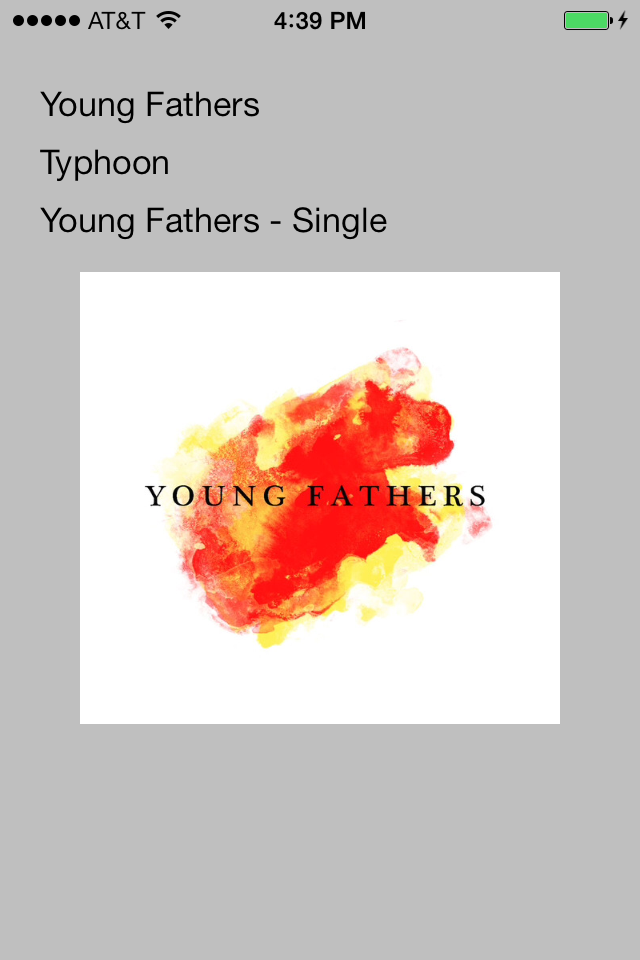

# Recipe

1. Add a reference to `MediaPlayer`
```
  using MediaPlayer;
```
<ol start="2">
  <li>Create a new <code>MPMusicPlayerController</code></li>
</ol>
```
  MPMusicPlayerController MyPlayer = new MPMusicPlayerController();
```
<ol start="3">
  <li>To get information about the currently playing song, use the <code>NowPlaying</code> property:</li>
</ol>

```
MPMediaItem Now = MyPlayer.NowPlayingItem;

UIImage MyArtwork = Now.Artwork.ImageWithSize (new CGSize(100, 100));

Track.Text = Now.Title;
Artist.Text = Now.Artist;
Album.Text = Now.AlbumTitle;
Lyrics.Text = Now.Lyrics;
Artwork.Image = MyArtwork;</code></pre>
```


# Additional Information

The MediaPlayer API does not run properly on a simulator. Always test on a device.

