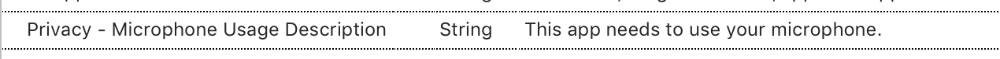

# Recipe

The easiest way to record sound in iOS is to use the built-in `AVAudioRecorder`
class:

1. Declare class-level variables:

        AVAudioRecorder recorder;
        NSError error;
        NSUrl url;
        NSDictionary settings;

2. You must initialize an audio session before trying to record:

        var audioSession = AVAudioSession.SharedInstance ();
        var err = audioSession.SetCategory (AVAudioSessionCategory.PlayAndRecord);
        if (err != null) {
            Console.WriteLine ("audioSession: {0}", err);
            return false;
        }
        err = audioSession.SetActive (true);
        if (err != null ){
            Console.WriteLine ("audioSession: {0}", err);
            return false;
        }

3. Specify the recording format and location to save the recording to. The
  recording format is specified as an `NSDictionary` with two `NSObject` arrays
  containing the keys and values of the format specification:

        //Declare string for application temp path and tack on the file extension
        string fileName = string.Format ("Myfile{0}.wav", DateTime.Now.ToString ("yyyyMMddHHmmss"));
        string audioFilePath = Path.Combine (Path.GetTempPath (), fileName);

        Console.WriteLine("Audio File Path: " + audioFilePath);

        url = NSUrl.FromFilename(audioFilePath);
        //set up the NSObject Array of values that will be combined with the keys to make the NSDictionary
        NSObject[] values = new NSObject[]
        {
            NSNumber.FromFloat (44100.0f), //Sample Rate
            NSNumber.FromInt32 ((int)AudioToolbox.AudioFormatType.LinearPCM), //AVFormat
            NSNumber.FromInt32 (2), //Channels
            NSNumber.FromInt32 (16), //PCMBitDepth
            NSNumber.FromBoolean (false), //IsBigEndianKey
            NSNumber.FromBoolean (false) //IsFloatKey
        };

        //Set up the NSObject Array of keys that will be combined with the values to make the NSDictionary
        NSObject[] keys = new NSObject[]
        {
            AVAudioSettings.AVSampleRateKey,
            AVAudioSettings.AVFormatIDKey,
            AVAudioSettings.AVNumberOfChannelsKey,
            AVAudioSettings.AVLinearPCMBitDepthKey,
            AVAudioSettings.AVLinearPCMIsBigEndianKey,
            AVAudioSettings.AVLinearPCMIsFloatKey
        };

        //Set Settings with the Values and Keys to create the NSDictionary
        settings = NSDictionary.FromObjectsAndKeys (values, keys);

        //Set recorder parameters
        recorder = AVAudioRecorder.Create(url, new AudioSettings(settings), out error);

4. Call `PrepareToRecord`, which initializes the recording framework.

        //Set Recorder to Prepare To Record
        recorder.PrepareToRecord();

5. Add the `NSMicrophoneUsageDescription` key value in the Source tab of the Info.plist file. This is added by selecting "Privacy – Microphone Usage Description" from the property drop down, and setting an appropriate string:

  

6. Call `Record` when you’re ready to begin recording the audio.

        recorder.Record();

7. When you’re finished recording call the `Stop` method on the recorder:

        recorder.stop();

# Additional Information

iOS has a number of powerful frameworks for working with audio. The technique
shown in this recipe is one of the simplest, but there are a number of others
that serve different purposes. For more information, see the [AVFoundation Programming Guide](https://developer.apple.com/library/content/documentation/AudioVideo/Conceptual/AVFoundationPG/Articles/00_Introduction.html) in the Apple iOS
documentation.

