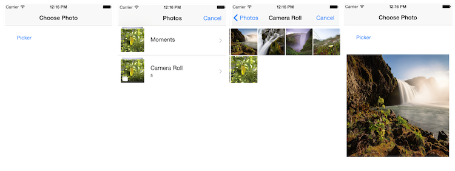
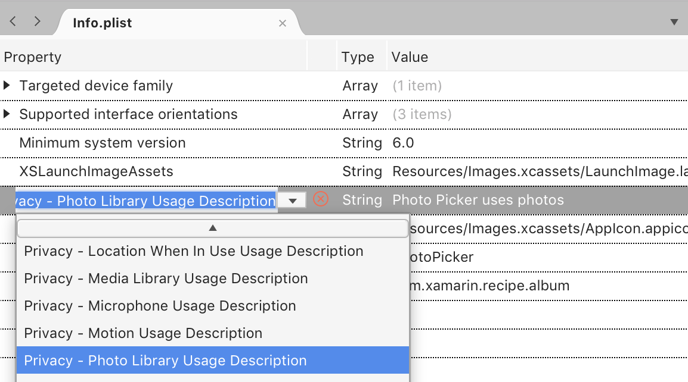

# iOS Recipe

Applications can ask the user to choose a photo (or video) from their Photo
Albums using UIImagePickerController. The sample code screens look like
this:

 [ ](Images/photo_screens_big.png)

To implement the photo picker:

1. Create the image picker control:

        imagePicker = new UIImagePickerController ();


2. Set the source and media type:

        imagePicker.SourceType = UIImagePickerControllerSourceType.PhotoLibrary;
        imagePicker.MediaTypes = UIImagePickerController.AvailableMediaTypes (UIImagePickerControllerSourceType.PhotoLibrary);


3. Assign delegate handler (to be implemented in steps 5 and 6):

        imagePicker.FinishedPickingMedia += Handle_FinishedPickingMedia;
        imagePicker.Canceled += Handle_Canceled;

4. Display the controller:

        NavigationController.PresentModalViewController(imagePicker, true);


5. Implement the handler method that checks the kind of file the user selected, and if it is an image displays it:

        protected void Handle_FinishedPickingMedia (object sender, UIImagePickerMediaPickedEventArgs e)
        {
            // determine what was selected, video or image
            bool isImage = false;
            switch(e.Info[UIImagePickerController.MediaType].ToString()) {
                case "public.image":
                    Console.WriteLine("Image selected");
                    isImage = true;
                    break;
                case "public.video":
                    Console.WriteLine("Video selected");
                    break;
            }

            // get common info (shared between images and video)
            NSUrl referenceURL = e.Info[new NSString("UIImagePickerControllerReferenceURL")] as NSUrl;
            if (referenceURL != null)
                Console.WriteLine("Url:"+referenceURL.ToString ());

            // if it was an image, get the other image info
            if(isImage) {
                // get the original image
                UIImage originalImage = e.Info[UIImagePickerController.OriginalImage] as UIImage;
                if(originalImage != null) {
                    // do something with the image
                    Console.WriteLine ("got the original image");
                    imageView.Image = originalImage; // display
                }
            } else { // if it's a video
                // get video url
                NSUrl mediaURL = e.Info[UIImagePickerController.MediaURL] as NSUrl;
                if(mediaURL != null) {
                    Console.WriteLine(mediaURL.ToString());
                }
            }
            // dismiss the picker
            imagePicker.DismissModalViewControllerAnimated (true);
        }

6. Implement the cancellation handler method so that the picker will disappear:

        void Handle_Canceled (object sender, EventArgs e) {
               imagePicker.DismissModalViewControllerAnimated(true);
        }

7. Open the Info.plist file and select the **Source** tab at the bottom. Click on a new line to add a new property. From the drop down list select _Privacy – Photo Library Usage Description_ and enter a string value to describe why the user should allow access:

  

**Note** You must add the [key/value pair](https://developer.xamarin.com/guides/ios/deployment,_testing,_and_metrics/provisioning/infoplist-reference/#Photos) into the Info.plist file. This allows the user to grant your app permission to use the Photo library. If you don't, your app will crash.

# Additional Information

In the finished handler you can also access additional properties of the
image (such as whether there is an edited version):

```
// get the edited image
UIImage editedImage = e.Info[UIImagePickerController.EditedImage] as UIImage;
if(editedImage != null) {
    // do something with the image
    Console.WriteLine ("got the edited image");
    imageView.Image = editedImage; // display
}
```

