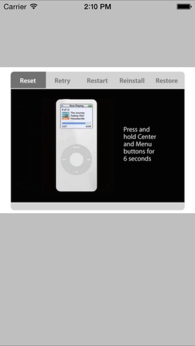

 

1.  Add `using AVFoundation;` to the top of the class file.
1.  Add the following class variable in a `UIViewController` subclass.

        AVPlayer player;
        AVPlayerLayer playerLayer;
        AVAsset asset;
        AVPlayerItem playerItem;

2.  Add a movie file named **sample.m4v** to the project. There is a sample file included in the project download for this recipe.
3.  Ensure that the file's **Build Action** is set to **Content**. You can do this by right-clicking on the file and selecting **Build Action** from the context menu that appears.
4.  In the ViewDidLoad method, create an `AVAsset` and pass it to an `AVPlayerItem`.

        asset = AVAsset.FromUrl (NSUrl.FromFilename ("sample.m4v"));
        playerItem = new AVPlayerItem (asset);

5.  Create an AVPlayer and pass it the AVPlayerItem created above.

        player = new AVPlayer (playerItem);

6.  Create an `AVPlayerLayer` from the `AVPlayer` instance and add as a sublayer to the view’s layer.

        playerLayer = AVPlayerLayer.FromPlayer (player);
        playerLayer.Frame = View.Frame;
        View.Layer.AddSublayer (playerLayer);

7.  Call the `Play` method of the `AVPlayer` instance to play the video.

        player.Play ();

# Additional Information

The `AVPlayer` is part of the `AVFoundation` framework and is available in the `AVFoundation` namespace.

