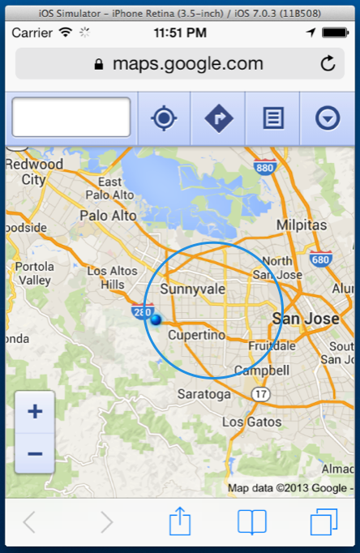

[ ](Images/00.png)

# Recipe

Geofences work by specifying a circular region - `CLCircularRegion` - and firing an event when the user crosses the `CLCircularRegion`'s boundary. A geofence subscribes to updates from the system's location manager, and will wake an application in the background to handle a boundary crossing event.

<ol>
  <li>Geofencing requires the <strong>CoreLocation</strong> library, so we'll start by adding the using directive:</li>
</ol>

```
using CoreLocation;
```
<ol start="2">
  <li>Next, let's create an instance of the <code>CLLocationManager</code> class to interact with system location services:</li>
</ol>
```
var LocMgr = new CLLocationManager();
```

<ol start="3">
  <li>Starting with iOS 8, applications must call <code>requestWhenInUseAuthorization</code> on <code>CLLocationManager</code> to gain access to the user's application. If the app hasn't been granted permission before, the user will be prompted to allow or deny access.</li>
</ol>
```
  LocMgr.requestAlwaysAuthorization(); //to access user's location in the background
  LocMgr.requestWhenInUseAuthorization(); //to access user's location when the app is in use.
```
<ol start="4">
  <li>In addition to explicitly requesting access to the user's location, you must add two keys to the <strong>Info.plist</strong> file, by opening <strong>Info.plist</strong> and selecting **Source**. </li>
</ol>
* **NSLocationWhenInUseUsageDescription** - A description of why your app wants to access the user's location in the foreground.
* **NSLocationAlwaysInUsageDescription** - A description of why your app wants to access the user's location in the background.

<ol start="5">
  <li>Next, we'll create a <code>CLCircularRegion</code> to track. We define a <code>CLCircularRegion</code> by specifying a center coordinate, a radius and a string identifier:</li>
</ol>

```
CLCircularRegion region = new CLCircularRegion(new CLLocationCoordinate2D(+37.29430502,-122.09423697), 10129.46, "Cupertino");
```
<ol start="6">
  <li>Not all devices have geofencing enabled, so before we begin monitoring, we'll want to check if location monitoring is available by calling the <code>CLLocationManager</code>'s <code>IsMonitoringAvailable</code> method, passing in <code>CLCircularRegion</code> as the <code>Type</code>. We can subscribe to three updates from our <code>LocMgr</code>: <code>RegionEntered</code> and <code>RegionLeft</code> to track the user's movement, and <code>DidStartMonitoringRegion</code> to let us know when a geofence has been established. The code example below shows us subscribing to all three events:</li>
</ol>

```
  if (CLLocationManager.IsMonitoringAvailable (typeof(CLCircularRegion))) {

  LocMgr.DidStartMonitoringForRegion += (o, e) =&gt; {
    Console.WriteLine ("Now monitoring region {0}", e.Region.ToString ());
  };

  LocMgr.RegionEntered += (o, e) =&gt; {
    Console.WriteLine ("Just entered " + e.Region.ToString ());
  };

  LocMgr.RegionLeft += (o, e) =&gt; {
    Console.WriteLine ("Just left " + e.Region.ToString ());
  };

  LocMgr.StartMonitoring (region);

  } else {
  Console.WriteLine ("This app requires region monitoring, which is unavailable on this device");
  }
```
<ol start="7">
  <li>Once we've subscribed to events, we can call <code>StartMonitoring</code> on the <code>LocMgr</code>, passing in a <code>CLCircularRegion</code>, as illustrated by the code above.</li>
  <li>To stop monitoring a region, call <code>StopMonitoring</code> on the <code>LocMgr</code>:</li>
</ol>

```
if (CLLocationManager.IsMonitoringAvailable (typeof(CLCircularRegion))) {
      LocMgr.StopMonitoring (region);
      Console.WriteLine ("Stopped monitoring region: {0}", region.ToString ());
    } else {
      Console.WriteLine ("This app requires region monitoring, which is unavailable on this device");
    }
```
<ol start="8">
  <li>Running the application should produce the following output:</li>
</ol>

```
Now monitoring region CLCircularRegion (identifier:'Cupertino', center:&lt;+37.29430502,-122.09423697&gt;, radius:10129.46m)
      Just entered CLCircularRegion (identifier:'Cupertino', center:&lt;+37.29430502,-122.09423697&gt;, radius:10129.46m)
      Just left CLCircularRegion (identifier:'Cupertino', center:&lt;+37.29430502,-122.09423697&gt;, radius:10129.46m)
```

To test geofences in the iOS simulator, refer to the <a href="/Recipes/ios/multitasking/test_location_changes_in_simulator" target="_blank">Test Location Changes in Simulator recipe</a>.</li>
</ol>

# Additional Information

While the code above will run in most situations, iOS location services require several more checks to ensure our geofencing application will run properly. First, we need to check if Location Services are enabled on the device by running `CLLocationManager.LocationServicesEnabled`. Then, we should ensure that the user has authorized our application access to their location by checking the value of `CLLocationManager.Status`, as illustrated by the code sample below:

```
if (CLLocationManager.LocationServicesEnabled) {

  if (CLLocationManager.Status != CLAuthorizationStatus.Denied) {

    if (CLLocationManager.IsMonitoringAvailable (typeof(CLCircularRegion))) {

      LocMgr.StopMonitoring (region);
      Console.WriteLine ("Stopped monitoring region: {0}", region.ToString ());

    } else {
      Console.WriteLine ("This app requires region monitoring, which is unavailable on this device");
    }

    LocMgr.Failed += (o, e) => {
      Console.WriteLine (e.Error);
    };

  } else {
    Console.WriteLine ("App is not authorized to use location data");
  }

} else {
  Console.WriteLine ("Location services not enabled, please enable this in your Settings");
}
```

