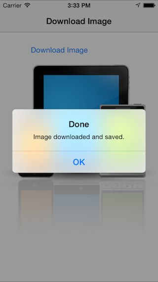

<a name="Recipe" class="injected"></a>


# Recipe

To download a text file follow these steps:

-  Add a new using statements to your code:


```
using System.Net;
using System.IO;
using System.Text;
```

-  Create a WebClient object:


```
var webClient = new WebClient();
```

-  Add an event handler that will execute when the download is complete. First it retrieves the downloaded text to a variable, then it creates a local file path and finally it saves the file to local storage:


```
webClient.DownloadDataCompleted += (s, e) => {
    var bytes = e.Result; // get the downloaded data
    string documentsPath = Environment.GetFolderPath(Environment.SpecialFolder.Personal);
    string localFilename = "downloaded.png";
    string localPath = Path.Combine (documentsPath, localFilename);
    File.WriteAllBytes (localPath, bytes); // writes to local storage
};
```

-  Create the Url for the file to download:


```
var url = new Uri("https://www.xamarin.com/content/images/pages/branding/assets/xamagon.png");
```

-  Finally trigger the download itself (when complete, the handler we defined in step 3 will execute):


```
webClient.DownloadDataAsync(url);
```

 <a name="Additional_Information" class="injected"></a>


# Additional Information

 [ ](Images/Downloaded.png)

The sample code looks like this screenshot when the file has been
successfully downloaded. The alert and text view are populated by adding the
following code to the completion handler defined in Step 3:

```
InvokeOnMainThread (() => {
    textView.Text = text;
    new UIAlertView ("Done", "Image downloaded and saved", null, "OK", null).Show();
});
```

Notice that all interactions with UI controls is done within an
InvokeOnMainThread method call. This is because the file download occurs
asynchronously (in a background thread), and background threads aren’t allowed
to access the UI directly.

