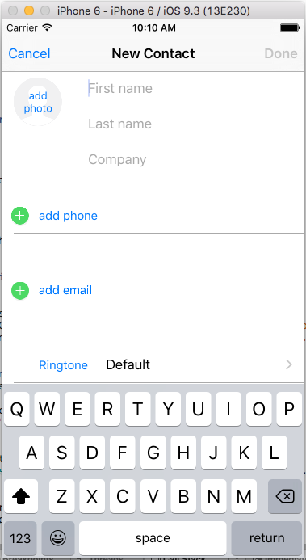
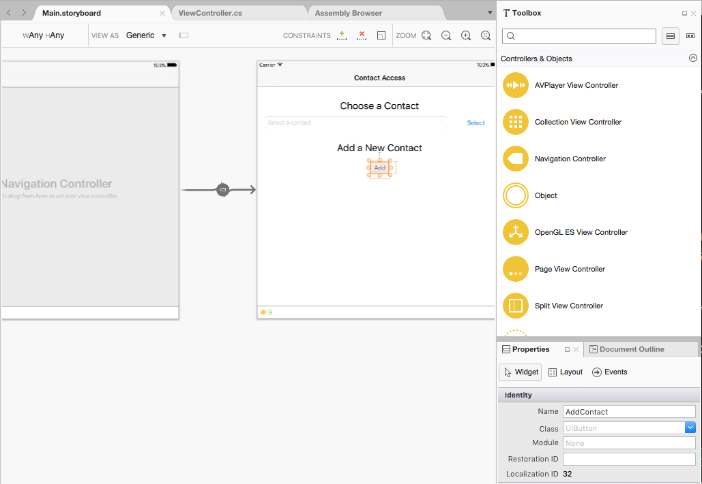

<a name="Recipe" class="injected"></a>
# Recipe

 [ ](Images/Add01.png)
 
The Contacts Framework provides Xamarin.iOS access to the user's contact information. Because most apps only require read-only access, this framework has been optimized for thread safe, read-only access.  

For any Xamarin.iOS app that needs to adjust the values of an existing contact (or create new ones), use the `NSMutableContact` version of the class and its sub classes (such as `CNMutablePostalAddress`).

To use the built-in Contact View Controller to add a new contact, do the following:

<a name="Design-your-UI" class="injected"></a>
## Design your UI

Design your app's User Interface that will be used to call the Contact View Controller. For example, a `UINavigationController` to house the Contact View and a `UIButton` to present it:

[ ](Images/Add02.png)

<a name="Adding-a-New-Contact" class="injected"></a>
## Adding a New Contact

Create a new contact and present the Contact View when the user clicks the button. For example:

```
using System;
using Foundation;
using Contacts;
using ContactsUI;
using UIKit;

namespace ContactAccess
{
	public partial class ViewController : UIViewController
	{
		protected ViewController (IntPtr handle) : base (handle)
		{
			
		}

		public override void ViewDidLoad ()
		{
			base.ViewDidLoad ();
		}

		partial void AddContact_TouchUpInside (UIButton sender)
		{

			// Create a new Mutable Contact (read/write)
			// and attach it to the editor
			var store = new CNContactStore ();
			var contact = new CNMutableContact ();
			var editor = CNContactViewController.FromNewContact (contact);

			// Configure editor
			editor.ContactStore = store;
			editor.AllowsActions = true;
			editor.AllowsEditing = true;

			// Display picker
			var navController = ParentViewController as UINavigationController;
			navController.PushViewController (editor, true);
		}
	}
}


```

Let's look at this code in detail:

1. First, it gains access to the Contact Store (`CNContactStore`).
2. Then it creates a new editable Contact (`CNMutableContact`) and attaches it to a Contact View: `CNContactViewController.FromNewContact (contact)`.
3. Then it attaches the Contact View to the Contact Store and configures it for editing.
4. Finally, it gains access to the parent Navigation Controller (`ParentViewController as UINavigationController`) and presents the editor: `navController.PushViewController (editor, true)`.

<a name="Additional_Information" class="injected"></a>
# Additional Information

For more information, please see our [Contacts and ContactUI](https://developer.xamarin.com/guides/ios/platform_features/introduction_to_ios9/contacts/) documentation.

