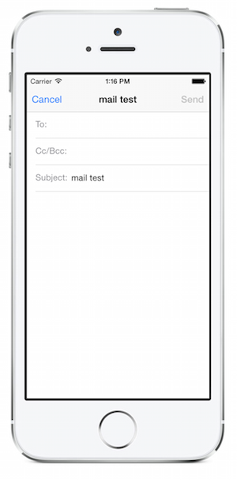

# Recipe

 [ ](Images/Send_an_Email.png)

To send an email using the `MFMailComposeViewController` follow these
steps.

1.  Create a class variable for an MFMailComposeViewController.


```
MFMailComposeViewController mailController;
```

<ol start="2">
  <li>Verify that the device is capable of sending mail -
  ensure you wrap all mail functionality inside the following
  <code>CanSendMail</code> check:</li>
</ol>

```
if (MFMailComposeViewController.CanSendMail) {
  // do mail operations here
}
```

<ol start="3">
  <li>Instantiate an <code>MFMailComposeViewController</code> instance.</li>
</ol>

```
mailController = new MFMailComposeViewController ();
```

<ol start="4">
  <li>Set the recipients, subject and message body.</li>
</ol>

```
mailController.SetToRecipients (new string[]{"john@doe.com"});
mailController.SetSubject ("mail test");
mailController.SetMessageBody ("this is a test", false);
```

<ol start="5">
  <li>Handle the Finished event.</li>
</ol>

```
mailController.Finished += ( object s, MFComposeResultEventArgs args) => {
  Console.WriteLine (args.Result.ToString ());
  args.Controller.DismissViewController (true, null);
};
```

<ol start="6">
  <li>Present the <code>MFMailComposeViewController</code>.</li>
</ol>

```
this.PresentViewController (mailController, true, null);
```

# Additional Information

The `MFMailComposeViewController` class has built-in
  support for sending emails. You can send emails
  to multiple recipients by including their addresses
  in the array passed into `SetToRecipients`. When the
  controller is dismissed, the result is available
  in the `Finished` event’s `MFComposeResultEventArgs.Result`,
  which is an `MFMailComposeResult` enumeration.

It is highly recommended that you test mail operations on
  real devices and not rely on results in the iOS Simulator

