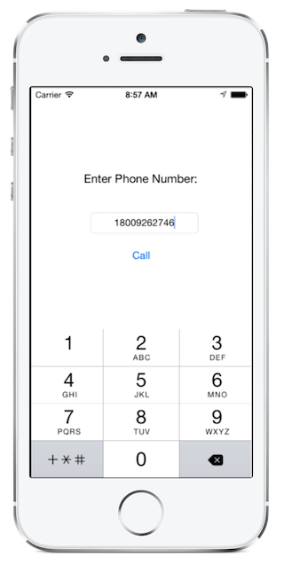

<a name="Recipe" class="injected"></a>

# Recipe




<ol>
  <li>First, we must generate a <code>NSUrl</code> from the string <code>"tel:"</code> appended to the number we want to dial. For this example, lets place the following code in the <code>CallButton</code> <code>TouchUpInside</code> event handler:</li>
</ol>
```
var url = new NSUrl ("tel:" + PhoneTextField.Text);
```
<ol start="2">
  <li>To create a scheme to access the Phone app, we would place the following code after we generate our <code>NSUrl</code> variable:</li>
</ol>
```
    UIApplication.SharedApplication.OpenUrl (url);
```
<ol start="3">
  <li>Since emulators don't support the system Phone app, we should instead attempt to create our scheme inside the following conditional statement:</li>
</ol>
```
    if (!UIApplication.SharedApplication.OpenUrl (url)) {
    	var av = new UIAlertView ("Not supported",
	      "Scheme 'tel:' is not supported on this device",
          null,
	      "OK",
		  null);
	    av.Show ();
    };
```
If the scheme cannot be generated, we alert the user using a `UIAlertView`.

