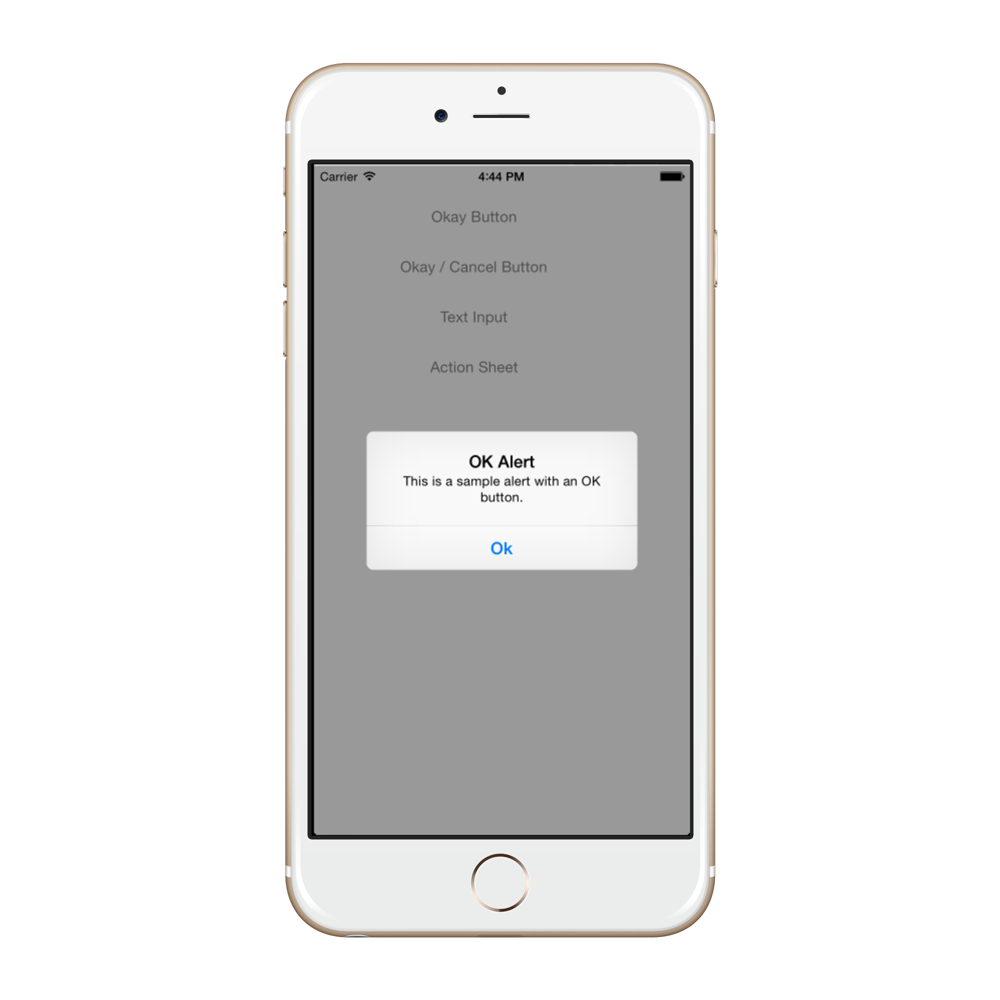
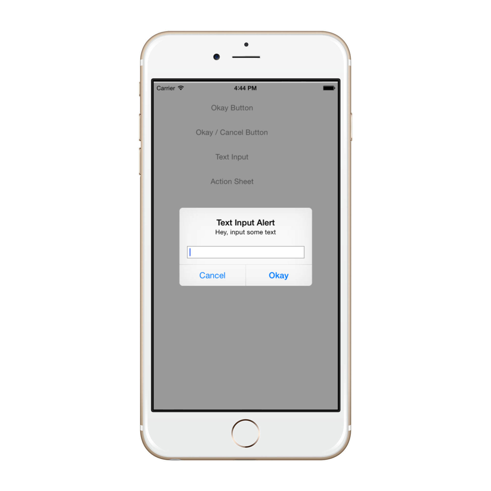
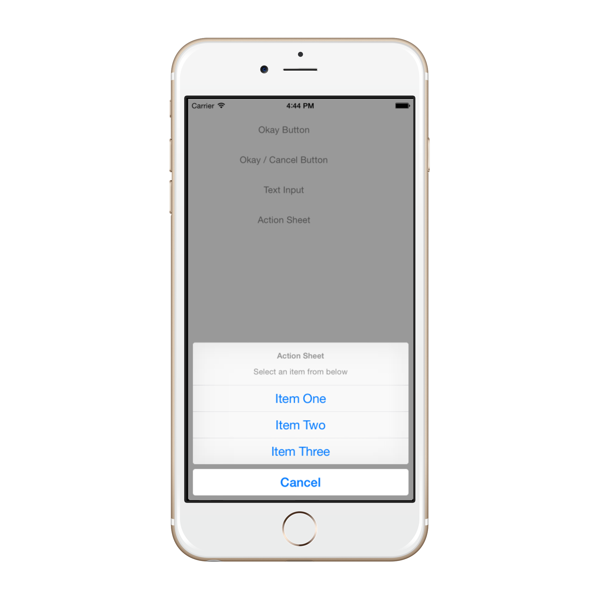

Starting with iOS 8, `UIAlertController` has completely replaced `UIActionSheet` and `UIAlertView`, both of which are now deprecated.

Unlike the classes it replaced, which are subclasses of `UIView`, `UIAlertController` is a subclass of `UIViewController`.

Use `UIAlertControllerStyle` to indicate the type of alert to display. These alerts types are:

- **UIAlertControllerStyleActionSheet**
	* pre iOS 8 this would have been a UIActionSheet
- **UIAlertControllerStyleAlert**
	* Pre iOS 8 this would have been UIAlertView

There are three steps to take when creating an AlertController:

- Create and configure the Alert
	* title
	* message
	* preferredStyle

- (Optional) Add a text field
- Add the Required actions
- Present the View Controller

# Alert with One Button




```
okayButton.TouchUpInside += (sender, e) => {

				//Create Alert
				var okAlertController = UIAlertController.Create ("OK Alert", "This is a sample alert with an OK button.", UIAlertControllerStyle.Alert);

				//Add Action
				okAlertController.AddAction (UIAlertAction.Create ("Ok", UIAlertActionStyle.Default, null));

				// Present Alert
				PresentViewController (okAlertController, true, null);
			};
```


# Alert with Two buttons


```
okayCancelButton.TouchUpInside += ((sender, e) => {

				//Create Alert
				var okCancelAlertController = UIAlertController.Create("OK / Cancel Alert", "This is a sample alert with an OK / Cancel Button", UIAlertControllerStyle.Alert);

				//Add Actions
				okCancelAlertController.AddAction(UIAlertAction.Create("Okay", UIAlertActionStyle.Default, alert => Console.WriteLine ("Okay was clicked")));
				okCancelAlertController.AddAction(UIAlertAction.Create("Cancel", UIAlertActionStyle.Cancel, alert => Console.WriteLine ("Cancel was clicked")));

				//Present Alert
				PresentViewController(okCancelAlertController, true, null);
			});
```

# Alert with Text Field




```
textInputButton.TouchUpInside += ((sender, e) => {

				//Create Alert
				var textInputAlertController = UIAlertController.Create("Text Input Alert", "Hey, input some text", UIAlertControllerStyle.Alert);

				//Add Text Input
				textInputAlertController.AddTextField(textField => {
				});

				//Add Actions
				var cancelAction = UIAlertAction.Create ("Cancel", UIAlertActionStyle.Cancel, alertAction => Console.WriteLine ("Cancel was Pressed"));
				var okayAction = UIAlertAction.Create ("Okay", UIAlertActionStyle.Default, alertAction => Console.WriteLine ("The user entered '{0}'", textInputAlertController.TextFields[0].Text));

				textInputAlertController.AddAction(cancelAction);
				textInputAlertController.AddAction(okayAction);

				//Present Alert
				PresentViewController(textInputAlertController, true, null);
			});
```

# ActionSheet Alert




```
actionSheetButton.TouchUpInside += ((sender, e) => {

				// Create a new Alert Controller
				UIAlertController actionSheetAlert = UIAlertController.Create("Action Sheet", "Select an item from below", UIAlertControllerStyle.ActionSheet);

				// Add Actions
				actionSheetAlert.AddAction(UIAlertAction.Create("Item One",UIAlertActionStyle.Default, (action) => Console.WriteLine ("Item One pressed.")));

				actionSheetAlert.AddAction(UIAlertAction.Create("Item Two",UIAlertActionStyle.Default, (action) => Console.WriteLine ("Item Two pressed.")));

				actionSheetAlert.AddAction(UIAlertAction.Create("Item Three",UIAlertActionStyle.Default, (action) => Console.WriteLine ("Item Three pressed.")));

				actionSheetAlert.AddAction(UIAlertAction.Create("Cancel",UIAlertActionStyle.Cancel, (action) => Console.WriteLine ("Cancel button pressed.")));

				// Required for iPad - You must specify a source for the Action Sheet since it is
				// displayed as a popover
				UIPopoverPresentationController presentationPopover = actionSheetAlert.PopoverPresentationController;
				if (presentationPopover!=null) {
					presentationPopover.SourceView = this.View;
					presentationPopover.PermittedArrowDirections = UIPopoverArrowDirection.Up;
				}

				// Display the alert
				this.PresentViewController(actionSheetAlert,true,null);
			});
```

