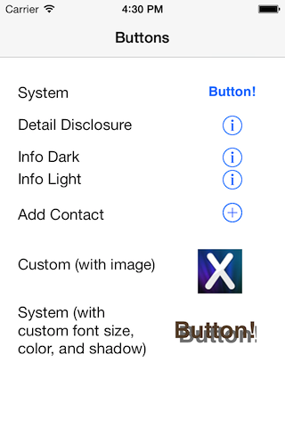

The UIButton control is a very common control that's both easy to use and
customizable. Additionally, there are a number of different built-in button
types available.

 

 

## Basic Usage

-   [Set Button Text](/Recipes/ios/standard_controls/buttons/set_button_text) 

 

## Interaction

-   [Handle Clicks](/Recipes/ios/standard_controls/buttons/handle_clicks) 

 

## Customization

-   [Create Different Types of Buttons](/Recipes/ios/standard_controls/buttons/create_different_types_of_buttons) 
-   [Use an Image for a Button](/Recipes/ios/standard_controls/buttons/use_an_image_for_a_button)
