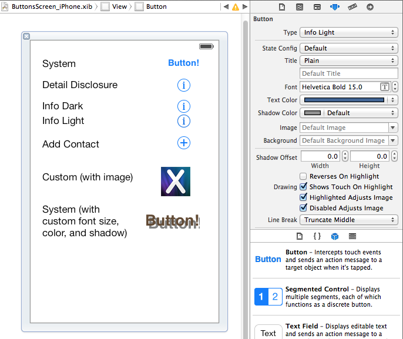

<a name="Recipe" class="injected"></a>


# Recipe

There are six different types of UIButton, enumerated in UIButtonType:

 **System**

 **DetailDisclosure**

 **InfoDark**

 **InfoLight**

 **ContactAdd**

 **Custom**

This screenshot shows the different types, along with two different custom
buttons: one with an image and one with formatted text. There is no real visual difference between some of these button types in iOS 7 and later.

 [ ](Images/Buttons1.png)

The sample code includes two different ViewControllers: one using an XIB file
and the other creating all the controls in C# code.

-  To create a button in code, use the `UIButton.FromType` static method like this:


```
var buttonRect = UIButton.FromType(UIButtonType.System);
```

-  If a text label is required, it is set using the `SetTitle` method:


```
buttonRect.SetTitle ("Button!", UIControlState.Normal);
```

If you use Interface Builder to create your user interface then you can
choose the button Type in the Attributes Inspector and set the other properties
appropriately.

 [ ](Images/Buttons_xib.png)

 <a name="Additional_Information" class="injected"></a>


# Additional Information

Buttons have multiple states (including Disabled, Selected and Highlighted).
In the example above the properties are only set for the Normal state, however
properties such as `Title` and `TitleColor` can be set independently for each state.
See the [Set Button Text](/Recipes/ios/standard_controls/buttons/set_button_text) recipe for an example.

