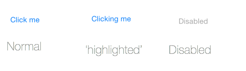

<a name="Recipe" class="injected"></a>


# Recipe

Buttons have a number of different states, and you can set the button text
once for all states or assign different values for each state.

To set the ‘default’ text for a button, call `SetTitle` for
`UIControlState.Normal` and that text will be used for all states:

```
buttonRect = UIButton.FromType(UIButtonType.RoundedRect);
buttonRect.SetTitle ("Click me", UIControlState.Normal);
```

Alternatively you can make each state different, as this image shows:

 

The code for these three states is:

```
buttonRect = UIButton.FromType(UIButtonType.RoundedRect);
buttonRect.SetTitle ("Click me", UIControlState.Normal);
buttonRect.SetTitle ("Clicking me", UIControlState.Highlighted);
buttonRect.SetTitle ("Disabled", UIControlState.Disabled);
buttonRect.SetTitleColor (UIColor.LightGray, UIControlState.Disabled);
```

You can also set the different states using the Xamarin Designer for iOS by choosing
each one from the drop-down-list of the properties panel.

