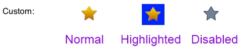

<a name="Recipe" class="injected"></a>


# Recipe

Buttons have a number of different states, and you can set the button image
once for all states or assign different values for each state.

To set the ‘default’ image for a button, call `SetImage` for
`UIControlState.Normal` and that image will be used for all states:

```
buttonRect = UIButton.FromType(UIButtonType.System);
buttonRect.SetImage(UIImage.FromFile ("star-gold45.png"), UIControlState.Normal);
```

Alternatively you can make each state different, as this image shows:

 

For most button types, only two states – Normal and Disabled – need to be set (the blue
highlighted color is automatically applied to the transparent parts of the
image):

For the `Custom` button type you must supply a separate image for the
`Highlighted` state if you wish the button to look different when pressed.

```
buttonStarCustom = UIButton.FromType(UIButtonType.Custom);
buttonStarCustom.SetImage (UIImage.FromFile ("star-gold45.png"), UIControlState.Normal);
buttonStarCustom.SetImage (UIImage.FromFile ("star-gold45_sel.png"), UIControlState.Highlighted);
buttonStarCustom.SetImage (UIImage.FromFile ("star-grey45.png"), UIControlState.Disabled);
```

 <a name="Additional_Information" class="injected"></a>


# Additional Information

You can also set the different states using Interface Builder by choosing
each one from the drop-down-list in the Attribute Inspector (see the Set Button
Text recipe for an example using Interface Builder).

