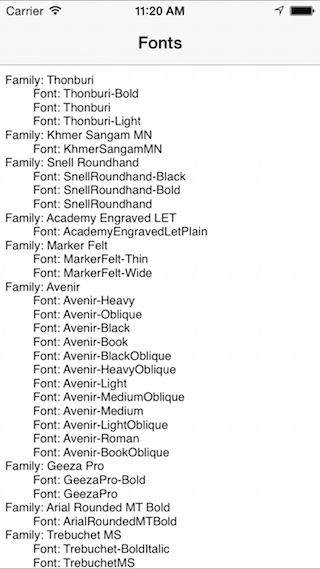

<a name="Recipe" class="injected"></a>


# Recipe

1.  Create a `UITextView` to display the font list:


```
fontListTextView = new UITextView(View.Bounds);
fontListTextView.AutoresizingMask = UIViewAutoresizing.FlexibleDimensions;
fontListTextView.Editable = false;
Add (fontListTextView);
```

<ol start="2">
  <li>Enumerate the fonts using the <code>UIFont</code> class:</li>
</ol>


```
var fontList = new StringBuilder();
var familyNames = UIFont.FamilyNames;
foreach (var familyName in familyNames ){
    fontList.Append(String.Format("Family: {0}\n", familyName));
    Console.WriteLine("Family: {0}\n", familyName);
    var fontNames = UIFont.FontNamesForFamilyName(familyName);
    foreach (var fontName in fontNames ){
        Console.WriteLine("\tFont: {0}\n", fontName);
        fontList.Append(String.Format("\tFont: {0}\n", fontName));
    }
};
fontListTextView.Text = fontList.ToString();
```

<ol start="3">
  <li>The font names are displayed on the screen and emitted to the Console.</li>
</ol>


 

 <a name="Additional_Information" class="injected"></a>


# Additional Information

A list of fonts available on iOS:

-  AcademyEngravedLetPlain
-  AmericanTypewriter-CondensedLight
-  AmericanTypewriter-Light
-  AmericanTypewriter
-  AmericanTypewriter-Condensed
-  AmericanTypewriter-Bold
-  AmericanTypewriter-CondensedBold
-  AppleColorEmoji
-  AppleSDGothicNeo-Medium
-  AppleSDGothicNeo-Bold
-  ArialMT
-  Arial-ItalicMT
-  Arial-BoldMT
-  Arial-BoldItalicMT
-  ArialHebrew
-  ArialHebrew-Bold
-  ArialRoundedMTBold
-  BanglaSangamMN-Bold
-  BanglaSangamMN
-  Baskerville
-  Baskerville-Italic
-  Baskerville-SemiBold
-  Baskerville-SemiBoldItalic
-  Baskerville-Bold
-  Baskerville-BoldItalic
-  BodoniSvtyTwoITCTT-Book
-  BodoniSvtyTwoITCTT-BookIta
-  BodoniSvtyTwoITCTT-Bold
-  BodoniSvtyTwoOSITCTT-Book
-  BodoniSvtyTwoOSITCTT-BookIt
-  BodoniSvtyTwoOSITCTT-Bold
-  BodoniSvtyTwoSCITCTT-Book
-  BodoniOrnamentsITCTT
-  BradleyHandITCTT-Bold
-  ChalkboardSE-Light
-  ChalkboardSE-Regular
-  ChalkboardSE-Bold
-  Chalkduster
-  Cochin
-  Cochin-Italic
-  Cochin-Bold
-  Cochin-BoldItalic
-  Copperplate-Light
-  Copperplate
-  Copperplate-Bold
-  Courier
-  Courier-Oblique
-  Courier-Bold
-  Courier-BoldOblique
-  CourierNewPSMT
-  CourierNewPS-BoldMT
-  CourierNewPS-BoldItalicMT
-  CourierNewPS-ItalicMT
-  DBLCDTempBlack
-  DevanagariSangamMN
-  DevanagariSangamMN-Bold
-  Didot
-  Didot-Italic
-  Didot-Bold
-  EuphemiaUCAS
-  EuphemiaUCAS-Italic
-  EuphemiaUCAS-Bold
-  Futura-Medium
-  Futura-MediumItalic
-  Futura-CondensedMedium
-  Futura-CondensedExtraBold
-  GeezaPro
-  GeezaPro-Bold
-  Georgia
-  Georgia-Italic
-  Georgia-Bold
-  Georgia-BoldItalic
-  GillSans-Light
-  GillSans-LightItalic
-  GillSans
-  GillSans-Italic
-  GillSans-Bold
-  GillSans-BoldItalic
-  GujaratiSangamMN
-  GujaratiSangamMN-Bold
-  GurmukhiMN
-  GurmukhiMN-Bold
-  STHeitiSC-Light
-  STHeitiSC-Medium
-  STHeitiTC-Light
-  STHeitiTC-Medium
-  Helvetica-Light
-  Helvetica-LightOblique
-  Helvetica
-  Helvetica-Oblique
-  Helvetica-Bold
-  Helvetica-BoldOblique
-  HelveticaNeue-UltraLight
-  HelveticaNeue-UltraLightItalic
-  HelveticaNeue-Light
-  HelveticaNeue-LightItalic
-  HelveticaNeue
-  HelveticaNeue-Italic
-  HelveticaNeue-Medium
-  HelveticaNeue-Bold
-  HelveticaNeue-BoldItalic
-  HelveticaNeue-CondensedBold
-  HelveticaNeue-CondensedBlack
-  HiraKakuProN-W3
-  HiraKakuProN-W6
-  HiraMinProN-W3
-  HiraMinProN-W6
-  HoeflerText-Regular
-  HoeflerText-Italic
-  HoeflerText-Black
-  HoeflerText-BlackItalic
-  Kailasa
-  Kailasa-Bold
-  KannadaSangamMN
-  KannadaSangamMN-Bold
-  MalayalamSangamMN
-  MalayalamSangamMN-Bold
-  Marion-Regular
-  Marion-Italic
-  Marion-Bold
-  MarkerFelt-Thin
-  MarkerFelt-Wide
-  Noteworthy-Light
-  Noteworthy-Bold
-  Optima-Italic
-  Optima-Regular
-  Optima-Bold
-  Optima-BoldItalic
-  Optima-ExtraBlack
-  OriyaSangamMN
-  OriyaSangamMN-Bold
-  Palatino-Roman
-  Palatino-Italic
-  Palatino-Bold
-  Palatino-BoldItalic
-  Papyrus
-  Papyrus-Condensed
-  PartyLetPlain
-  SinhalaSangamMN
-  SinhalaSangamMN-Bold
-  SnellRoundhand
-  SnellRoundhand-Bold
-  SnellRoundhand-Black
-  TamilSangamMN
-  TamilSangamMN-Bold
-  TeluguSangamMN
-  TeluguSangamMN-Bold
-  Thonburi
-  Thonburi-Bold
-  TimesNewRomanPSMT
-  TimesNewRomanPS-ItalicMT
-  TimesNewRomanPS-BoldMT
-  TimesNewRomanPS-BoldItalicMT
-  TrebuchetMS
-  TrebuchetMS-Italic
-  TrebuchetMS-Bold
-  Trebuchet-BoldItalic
-  Verdana
-  Verdana-Italic
-  Verdana-Bold
-  Verdana-BoldItalic
-  ZapfDingbatsITC
-  Zapfino

