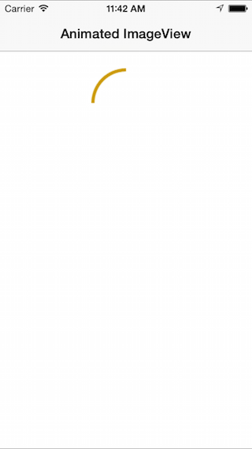

# Recipe

To display an image:

-  Edit `Assets.xcassets` file that is automatically added to the project, right-click and select **New Image Set**.

-  Double-click the new image set **Name** and change it to `Spinning Circle_1`, for example.

-  Click on *1x* under the **Universal** section and select an image to display from the hard drive.

-  Repeat the steps above to add all of the necessary images.

-  To create a `UIImageView` and display it from code use:

		var animatedCircleImage = new UIImageView ();
		animatedCircleImage.Frame = new CoreCraphics.CGRect(110, 20, 100, 100);
		View.AddSubview(animatedCircleImage);

- Optionally, in the iOS Designer, drag an **Image View** onto a **View** and position and size it as desired. 

- In the **Properties Explorer**, under **Identity** set the **Name** to `animatedCircleImage`.

- Also in the **Properties Explorer**, under **Image View** use the **Image** dropdown to select `Spinning Circle_1`.

- In code, create an array of the image frames and assign it to `AnimationImages`:

		animatedCircleImage.AnimationImages = new UIImage[] {
		      UIImage.FromBundle ("Spinning Circle_1.png")
		    , UIImage.FromBundle ("Spinning Circle_2.png")
		    , UIImage.FromBundle ("Spinning Circle_3.png")
		    , UIImage.FromBundle ("Spinning Circle_4.png")
		};

-  Set the animation properties and start animating:

		animatedCircleImage.AnimationRepeatCount = 0;
		animatedCircleImage.AnimationDuration = .5;
		animatedCircleImage.StartAnimating();

The sample code shows the circle animating (difficult to demonstrate in a
screenshot):

 
