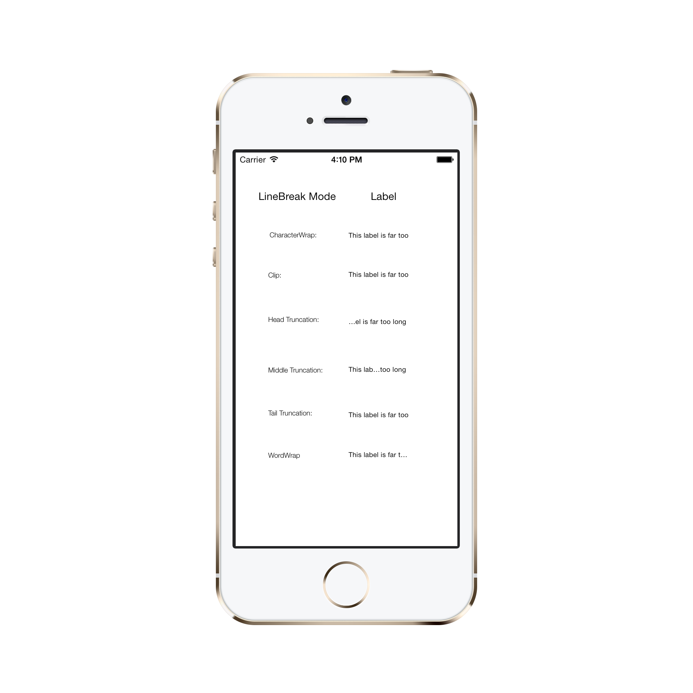

<a name="Recipe" class="injected"></a>


# Recipe




* `CharacterWrap` sets the text in the `UILabel` to wrap at the first character that doesn't fit. We can set a `UILabel` to this mode with the following line of code:

```
CharWrapLabel.LineBreakMode = UILineBreakMode.CharacterWrap;
```
* We can put this, and all other UILabel manipulations inside the `ViewDidLoad` method of the `ViewController`, or whatever method you are using to manipulate the UI element.


* `Clip` mode has the text which does not fit to remain unrendered. We can set a  `UILabel` to this mode with the following line of code:

````
ClipLabel.LineBreakMode = UILineBreakMode.Clip;
````


* `HeadTruncation` mode has the `UILabel` show the end of the text and truncates the head to an ellipse. We can set a  `UILabel` to this mode with the following line of code:

```
HeadLabel.LineBreakMode = UILineBreakMode.HeadTruncation;
```


* `MiddleTruncation` mode has the `UILabel` show the start and end of the text and truncates the middle to an ellipse. We can set a  `UILabel` to this mode with the following line of code:

````
MiddleLabel.LineBreakMode = UILineBreakMode.MiddleTruncation;
````


* `TailTruncation` mode has the `UILabel` show the start of the text and truncates the end to an ellipse. We can set a  `UILabel` to this mode with the following line of code:

````
TailLabel.LineBreakMode = UILineBreakMode.TailTruncation;
````


* `WordWrap` mode has the `UILabel` wrap the first word that does not fit. We can set a  `UILabel` to this mode with the following line of code:

````
TailLabel.LineBreakMode = UILineBreakMode.WordWrap;
````

