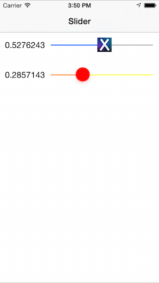

Sliders are a horizontal UI control that display a single value to the user
between a given range.&nbsp;

 

-   [Specify Slider Appearance](/Recipes/ios/standard_controls/sliders/specify_slider_appearance) 
-   [Specify Slider Value](/Recipes/ios/standard_controls/sliders/specify_slider_value)
