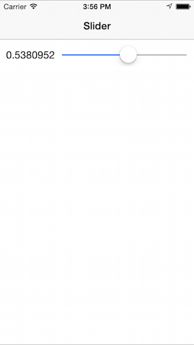

<a name="Recipe" class="injected"></a>


# Recipe

To create a slider and set its initial value:

1. Create a `UISlider` and add it to the View:

```
slider = new UISlider(new CGRect(100,  30, 210, 20));
View.Add (slider);
```

<ol start="2">
  <li>Set the slider minimum, maximum and initial value:</li>
</ol>

```
slider.MinValue = 0f;
slider.MaxValue = 1f;
slider.Value = 0.5f; // initial value
```

<ol start="3">
  <li>Attach an event to respond to any changes in the slider:</li>
</ol>

```
slider.ValueChanged += HandleValueChanged; // defined below
```

<ol start="4">
  <li>Create a method to handle the changed value. In the example the value is displayed in a label as the slider is dragged:</li>
</ol>

```
void HandleValueChanged (object sender, EventArgs e)
{   // display the value in a label
   label.Text = slider.Value.ToString ();
};
```

The sample looks like this when running:

 

