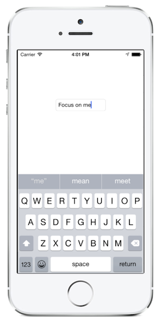

# Recipe




To have our `UITextField`, in this case named `FocusTextField`, selected as soon as we open the view, we can place the following line of code in the `ViewDidLoad()` method:

```
FocusTextField.BecomeFirstResponder ();
```

Additional Information
----------------------

We can call `BecomeFirstResponder` on a `UITextField` at any point to switch focus - not just inside `ViewDidLoad`.

