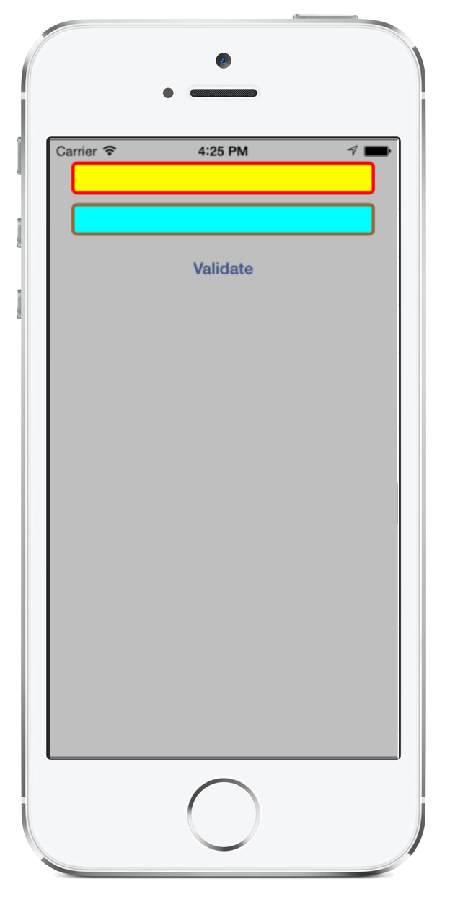
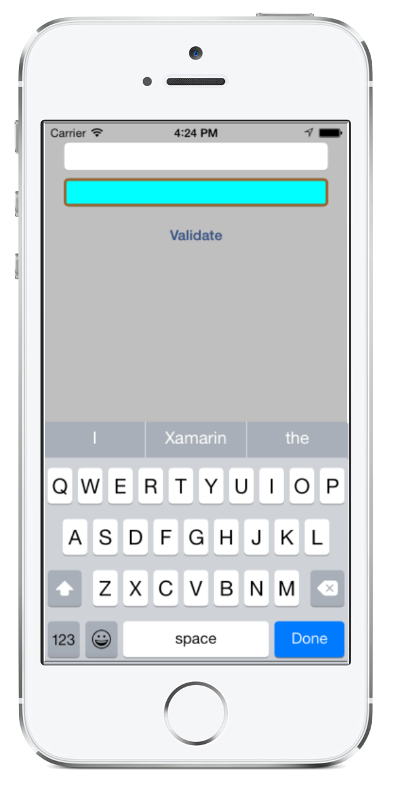

<a name="Recipe" class="injected"></a>


# Recipe

One of the easiest ways to show validation errors in iOS is to highlight the
border of the text field. This Recipe shows how to do just that either after
the user has entered text, or via a button press.

 <a name="Via_EditingDidEnd" class="injected"></a>


## Via EditingDidEnd

The `EditingDidEnd` event is raised when a user moves focus from a control,
either from selecting the next control, or from clicking the **Done**
button. The border properties on the text field can be accessed via the underlying `Layer` object:

```
// to validate after the user has entered text and moved away from that
// text field, use EditingDidEnd
this.FirstText.EditingDidEnd += (object sender, EventArgs e) => {

	// perform a simple "required" validation
	if ( ((UITextField)sender).Text.Length <= 0 ) {
		// need to update on the main thread to change the border color
		InvokeOnMainThread ( () => {
			this.FirstText.BackgroundColor = UIColor.Yellow;
			this.FirstText.Layer.BorderColor = UIColor.Red.CGColor;
			this.FirstText.Layer.BorderWidth = 3;
			this.FirstText.Layer.CornerRadius = 5;
		} );
	}
};
```

The result is the following:

 [ ](Images/01_-_EditingDidEnd.png)

 <a name="Via_a_Button" class="injected"></a>


## Via a Button

Validation can also be done at the push of a button:

```
// we can also validate on the touch of a button
this.ValidateButton.TouchUpInside += (object sender, EventArgs e) => {
	if ( this.SecondText.Text.Length <= 0 ) {
			InvokeOnMainThread ( () => {
			this.SecondText.BackgroundColor = UIColor.Cyan;
			this.SecondText.Layer.BorderColor = UIColor.Brown.CGColor;
			this.SecondText.Layer.BorderWidth = 3;
			this.SecondText.Layer.CornerRadius = 5;
		} );
	}
};
```

The result is the following:

 [ ](Images/02_-_ButtonSubmit.png)

