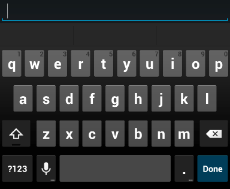
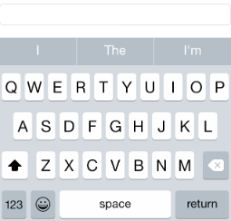
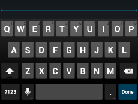
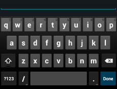
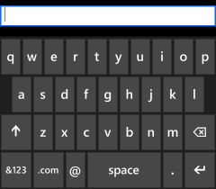
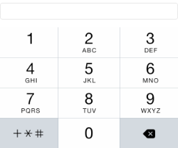
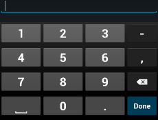

# Overview

The `Entry` control defines a `Keyboard` property that allows an app to select the virtual keyboard that is displayed for the control. For example, a keyboard for entering a phone number should be different from a keyboard for entering an email address.

## Specifying a virtual Keyboard

The `Keyboard` property is of type `Keyboard`. This class defines read-only properties that are appropriate for different keyboard uses:

- `Default`
- `Text`
- `Chat`
- `Url`
- `Email`
- `Telephone`
- `Numeric`

### Default Keyboard

In the code building the user interface for a page, add a `Keyboard` property to an `Entry`, and set the property to `Default`. This specifies that the default virtual keyboard will be displayed. This keyboard is displayed if a `Keyboard` property isn't specified.

```xml
<Entry Keyboard="Default" />
```

The `Default` keyboard is shown below for the three phone platforms.

  

### Text Keyboard

In the code building the user interface for a page, add a `Keyboard` property to an `Entry`, and set the property to `Text`. This specifies that a virtual keyboard suitable for entering text will be displayed.

```xml
<Entry Keyboard="Text" />
```

The `Text` keyboard is shown below for the three phone platforms.

  

### Chat Keyboard

In the code building the user interface for a page, add a `Keyboard` property to an `Entry`, and set the property to `Chat`. This specifies that a virtual keyboard suitable for chatting will be displayed.

```xml
<Entry Keyboard="Chat" />
```

The `Chat` keyboard is shown below for the three phone platforms.

  

### Url Keyboard

In the code building the user interface for a page, add a `Keyboard` property to an `Entry`, and set the property to `Url`. This specifies that a virtual keyboard suitable for entering a URL will be displayed.

```xml
<Entry Keyboard="Url" />
```

The `Url` keyboard is shown below for the three phone platforms.

  

### Email Keyboard

In the code building the user interface for a page, add a `Keyboard` property to an `Entry`, and set the property to `Email`. This specifies that a virtual keyboard suitable for entering an email address will be displayed.

```xml
<Entry Keyboard="Email" />
```

The `Email` keyboard is shown below for the three phone platforms.

  

### Telephone Keyboard

In the code building the user interface for a page, add a `Keyboard` property to an `Entry`, and set the property to `Telephone`. This specifies that a virtual keyboard suitable for entering a phone number will be displayed.

```xml
<Entry Keyboard="Telephone" />
```

The `Telephone` keyboard is shown below for the three phone platforms.

  

### Numeric Keyboard

In the code building the user interface for a page, add a `Keyboard` property to an `Entry`, and set the property to `Numeric`. This specifies that a virtual keyboard suitable for entering numeric data will be displayed.

```xml
<Entry Keyboard="Numeric" />
```

The `Numeric` keyboard is shown below for the three phone platforms.

  

## Specifying additional keyboard options

The `Create` method of the `Keyboard` class accepts a `KeyboardFlags` enumeration that specifies additional keyboard options such as capitalization, spellcheck, and suggestions.

### Sentence capitalization

In the code building the user interface for a page, add a `Keyboard` property to an `Entry`, and use the `Create` method to specify the `CapitalizeSentence` constant of the `KeyboardFlags` enumeration. This specifies that the first words of sentences will be automatically capitalized.

```
Content = new StackLayout {
  Padding = new Thickness(0,20,0,0),
  Children = {
    new Entry { Keyboard = Keyboard.Create(KeyboardFlags.CapitalizeSentence) }
  }
};
```

### Spellcheck

In the code building the user interface for a page, add a `Keyboard` property to an `Entry`, and use the `Create` method to specify the `SpellCheck` constant of the `KeyboardFlags` enumeration. This specifies that a spellcheck will be performed on text that the user enters.

```
Content = new StackLayout {
  Padding = new Thickness(0,20,0,0),
  Children = {
    new Entry { Keyboard = Keyboard.Create(KeyboardFlags.Spellcheck) }
  }
};
```

### Suggestions

In the code building the user interface for a page, add a `Keyboard` property to an `Entry`, and use the `Create` method to specify the `Suggestions` constant of the `KeyboardFlags` enumeration. This specifies that suggested word completions will be offered on text that the user enters.

```
Content = new StackLayout {
  Padding = new Thickness(0,20,0,0),
  Children = {
    new Entry { Keyboard = Keyboard.Create(KeyboardFlags.Suggestions) }
  }
};
```

### All

In the code building the user interface for a page, add a `Keyboard` property to an `Entry`, and use the `Create` method to specify the `All` constant of the `KeyboardFlags` enumeration. This specifies that the first words of sentences will be automatically capitalized, that a spellcheck will be performed on text that the user enters, and that suggested word completions will be offered on text that the user enters.

```
Content = new StackLayout {
  Padding = new Thickness(0,20,0,0),
  Children = {
    new Entry { Keyboard = Keyboard.Create(KeyboardFlags.All) }
  }
};
```

# Summary

This recipe shows how to display a virtual keyboard that is appropriate for the input text type, and how to specify additional keyboard options such as capitalization, spellcheck, and suggestions.

