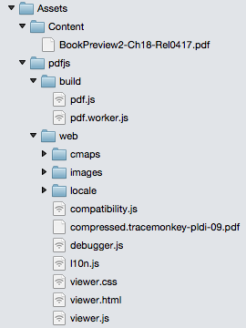

# Overview

The Xamarin.Forms [`WebView`](https://developer.xamarin.com/api/type/Xamarin.Forms.WebView/) control displays HTML and other web content in an app. Unlike [`Device.OpenUri`](https://developer.xamarin.com/api/member/Xamarin.Forms.Device.OpenUri/p/System.Uri/), which takes the user to the web browser on the device, the `WebView` control displays the web content inside the app. For more information about the `WebView` control, see [WebView](https://developer.xamarin.com/api/type/Xamarin.Forms.WebView/).

The [`WebView`](https://developer.xamarin.com/api/type/Xamarin.Forms.WebView/) control can display PDF files on the iOS platform, but not on the Android and Windows Phone platforms due to lack of platform support. On the Android and Windows Phone platforms, Mozilla's [`pdf.js`](https://mozilla.github.io/pdf.js/) can be used to add this support. `pdf.js` is a JavaScript library for parsing and rendering PDFs using the HTML5 `canvas` element. The following screenshots show the result of displaying a PDF file in the `WebView` control on each platform:


When a [`WebView`](https://developer.xamarin.com/api/type/Xamarin.Forms.WebView/) control is rendered by a Xamarin.Forms application, in iOS the `WebViewRenderer` class is instantiated, which in turns instantiates a native `UIWebView` control. On the Android platform, the `WebViewRenderer` class instantiates a native `WebView` control. On the Windows Phone platform, the `WebViewRenderer` class instantiates a native `WebView` control. The rendering process can be taken advantage of to display a local PDF file in a `WebView`, by creating a custom renderer for the `WebView` on each platform. The process for doing this is as follows:

1. [Create](#Creating_the_Custom_WebView_Control) a Xamarin.Forms custom control.
1. [Consume](#Consuming_the_Custom_Control) the custom control from Xamarin.Forms.
1. [Create](#Creating_the_Custom_Renderer_on_Each_Platform) the custom renderer for the control on each platform.

For information about customizing a [`WebView`](https://developer.xamarin.com/api/type/Xamarin.Forms.WebView/) control using a custom renderer, see [Implementing a HybridWebView](https://developer.xamarin.com/guides/xamarin-forms/custom-renderer/hybridwebview/).

## Creating the Custom WebView Control

Create a `CustomWebView` class which has a `Uri` property:

```
public class CustomWebView : WebView
{
	public static readonly BindableProperty UriProperty = BindableProperty.Create (propertyName:"Uri",
			returnType:typeof(string),
			declaringType:typeof(CustomWebView),
			defaultValue:default(string));

	public string Uri {
		get { return (string)GetValue (UriProperty); }
		set { SetValue (UriProperty, value); }
	}
}
```

The `Uri` property will be populated with the filename of the PDF file to be displayed.

## Consuming the Custom Control

Consume the `CustomWebView` control by declaring an instance of it in the XAML page instance:

```
<ContentPage xmlns="http://xamarin.com/schemas/2014/forms"
			 xmlns:x="http://schemas.microsoft.com/winfx/2009/xaml"
			 xmlns:local="clr-namespace:DisplayPDF;assembly=DisplayPDF"
			 x:Class="DisplayPDF.WebViewPage"
			 Padding="0,20,0,0">
	<ContentPage.Content>
		<local:CustomWebView Uri="BookPreview2-Ch18-Rel0417.pdf" HorizontalOptions="FillAndExpand" VerticalOptions="FillAndExpand" />
	</ContentPage.Content>
</ContentPage>
```

Alternatively, consume the `CustomWebView` control by declaring an instance of it in the C# page instance:

```
public class WebViewPageCS : ContentPage
{
	public WebViewPageCS ()
	{
		Padding = new Thickness (0, 20, 0, 0);
		Content = new StackLayout {
			Children = {
				new CustomWebView {
					Uri = "BookPreview2-Ch18-Rel0417.pdf",
					HorizontalOptions = LayoutOptions.FillAndExpand,
					VerticalOptions = LayoutOptions.FillAndExpand
				}
			}
		};
	}
}
```

## Creating the Custom Renderer on Each Platform

A custom renderer must now be added to each application project to add support for displaying local PDF files on each platform.

### Creating the Custom Renderer on iOS

Create a subclass of the `ViewRenderer<T1, T2>` class and override its `OnElementChanged` method, to display the local PDF file in a native `UIWebView` control:

```
[assembly: ExportRenderer (typeof(CustomWebView), typeof(CustomWebViewRenderer))]
namespace DisplayPDF.iOS
{
	public class CustomWebViewRenderer : ViewRenderer<CustomWebView, UIWebView>
	{
		protected override void OnElementChanged (ElementChangedEventArgs<CustomWebView> e)
		{
			base.OnElementChanged (e);

			if (Control == null) {
				SetNativeControl (new UIWebView ());
			}
			if (e.OldElement != null) {
				// Cleanup
			}
			if (e.NewElement != null) {
				var customWebView = Element as CustomWebView;
				string fileName = Path.Combine (NSBundle.MainBundle.BundlePath, string.Format ("Content/{0}", WebUtility.UrlEncode (customWebView.Uri)));
				Control.LoadRequest (new NSUrlRequest (new NSUrl (fileName, false)));
				Control.ScalesPageToFit = true;
			}
		}
	}
}
```

Provided that the custom renderer is attached to a new Xamarin.Forms element, the `LoadRequest` method loads the local PDF file that's specified by the `CustomWebView.Uri` property. The code assumes that the file is stored in the `Content` folder of the project. Pinch-to-zoom functionality is enabled by setting the `ScalesPageToFit` property to `true`.

For more information about subclassing the `ViewRenderer<T1, T2>` class, see [Implementing a View](https://developer.xamarin.com/guides/xamarin-forms/custom-renderer/view/).

### Creating the Custom Renderer on Android

Add [`pdf.js`](https://mozilla.github.io/pdf.js/) to the `Assets` folder in the Android project. The `Assets` folder should contain the following folder structure:


Then, create a subclass of the `WebViewRenderer` class and override its `OnElementChanged` method, to display the local PDF file in a native `WebView` control:

```
[assembly: ExportRenderer (typeof(CustomWebView), typeof(CustomWebViewRenderer))]
namespace DisplayPDF.Droid
{
	public class CustomWebViewRenderer : WebViewRenderer
	{
		protected override void OnElementChanged (ElementChangedEventArgs<WebView> e)
		{
			base.OnElementChanged (e);

			if (e.NewElement != null) {
				var customWebView = Element as CustomWebView;
				Control.Settings.AllowUniversalAccessFromFileURLs = true;
				Control.LoadUrl (string.Format ("file:///android_asset/pdfjs/web/viewer.html?file={0}", string.Format ("file:///android_asset/Content/{0}", WebUtility.UrlEncode (customWebView.Uri))));
			}
		}
	}
}
```

Provided that the custom renderer is attached to a new Xamarin.Forms element, the `LoadUrl` method loads the `viewer.html` file provided by `pdf.js`. This file accepts a `?file=` query string that's set to the local PDF file specified by the `CustomWebView.Uri` property. The code assumes that the file is stored in the `Assets/Content` folder of the project.

> ℹ️ **Note**: API levels below 19 are not capable of loading the local PDF file by specifying a `?file=` query string to the viewer URL. Instead, modify the `DEFAULT_URL` variable in the `Assets/pdfjs/web/viewer.js` file to reference the local PDF file.

### Creating the Custom Renderer on Windows Phone

Add [`pdf.js`](https://mozilla.github.io/pdf.js/) to the `Assets` folder in the Android project. The `Assets` folder should contain the following folder structure:



Then, create a subclass of the `WebViewRenderer` class and override its `OnElementChanged` method, to display the local PDF file in a native `WebView` control:

```
[assembly: ExportRenderer(typeof(CustomWebView), typeof(CustomWebViewRenderer))]
namespace DisplayPDF.WinPhone81
{
    public class CustomWebViewRenderer : WebViewRenderer
    {
        protected override void OnElementChanged(ElementChangedEventArgs<WebView> e)
        {
            base.OnElementChanged(e);

            if (e.NewElement != null)
            {
                var customWebView = Element as CustomWebView;
                Control.Source = new Uri(string.Format("ms-appx-web:///Assets/pdfjs/web/viewer.html?file={0}", string.Format ("ms-appx-web:///Assets/Content/{0}", WebUtility.UrlEncode(customWebView.Uri))));
            }
        }
    }
}
```

Provided that the custom renderer is attached to a new Xamarin.Forms element, the `Source` property of the `WebView` is set to the `viewer.html` file provided by `pdf.js`. This file accepts a `?file=` query string that's set to the local PDF file specified by the `CustomWebView.Uri` property. The code assumes that the file is stored in the `Assets/Content` folder of the project.

# Summary

This recipe showed how to display a local PDF file in a [`WebView`](https://developer.xamarin.com/api/type/Xamarin.Forms.WebView/) control on each platform.

