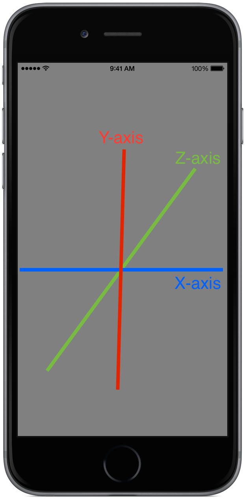

Xamarin.Forms includes first-class support for rotating views in three dimensions. Every `View` instance exposes `Rotation`, `RotationX`, and `RotationY` as values that can be set or bound. 

## Understanding Rotation and Position

`View`s have [`AnchorX`](https://developer.xamarin.com/api/property/Xamarin.Forms.VisualElement.AnchorX/) and [`AnchorY`](https://developer.xamarin.com/api/property/Xamarin.Forms.VisualElement.AnchorY/) properties that define how a view is positioned. Rotation is applied relative to the anchor values. Rotation is interpreted as a degree value rather than a radian or gradian value. 

Rotation values apply to the axes as follows:

- **[`Rotation`](#Rotation)** &ndash; rotates around the Z-axis. When holding a phone normally, the Z-axis extends out towards the user. 
- **[`RotationX`](#RotationX)** &ndash; rotates around the X-axis. When holding a phone normally, the X-axis extends out towards the user's left and right.
- **[`RotationY`](#RotationY)** &ndash; rotates around the Y-axis. When holding a phone normally, the Y-axis extends down towards the ground and up towards the sky.

See the following illustration to better understand how objects are rotated around the axes:



## Rotation

The `Rotation` property rotates the view around the z-axis. Consider the following XAML that rotates a label 52 degrees about the z-axis:

```
<Label Text="Rotation" Rotation="52" />
```

In C#:

```
var label = new Label { Text = "Rotation", Rotation = 52 };
```


## RotationX

The `RotationX` property rotates the view around the x-axis. Consider the following XAML that rotates a label 73 degrees about the x-axis:

```
<Label Text="RotationX" RotationX="73" />
```

In C#:

```
var label = new Label { Text = "RotationX", RotationX = 73 };
```


## RotationY

The `RotationY` property rotates the view around the y-axis. Consider the following XAML that rotates a label 122 degrees about the y-axis:

```
<Label Text="RotationY" RotationY="122" />
```

In C#:

```
var label = new Label { Text = "RotationY", RotationY = 122 };
```


