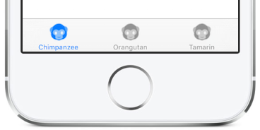
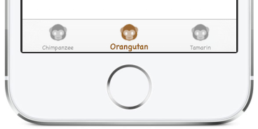

By default the Xamarin.Forms `TabbedPage` will render on iOS devices
with the default colors and font styles:

[ ](Images/tabs-default.png)

This example shows how to customize:

* tab color, and
* tab font face, size, and style.

The following screenshot shows the tab bar after it has been customized:

[ ](Images/tabs-custom.png)


## Tab Color

To change the color used for the iOS tabs, follow the instructions for
setting [iOS-specific styles](https://developer.xamarin.com/guides/xamarin-forms/platform-features/ios/theme/)
with Xamarin.Forms.

The following code is added to the **AppDelegate.cs** file in the
`FinishedLaunching` method to achieve a brown tint on the selected tab:

```
UITabBar.Appearance.SelectedImageTintColor = UIColor.Brown;
```

## Font

A [custom renderer](https://developer.xamarin.com/guides/xamarin-forms/custom-renderer/) is required to
customize the font face, style, and size. The complete custom renderer
code is shown below. It uses the *Chalkboard* font in both *Light* and *Bold*
styles, and 9 point font for unselected tabs with 12 point for the selected tab.

This file is added to the iOS project in the Xamarin.Forms solution -- no change
is required to the common Xamarin.Forms code (and it works regardless of whether
the user interface is declaring using C# or XAML).

**ExtendedTabbedPageRenderer.cs**

```
using System;
using System.Collections.Generic;
using System.Text;
using Xamarin.Forms;
using Xamarin.Forms.Platform.iOS;
using UIKit;
using TabbedPageDemo.iOS;

[assembly: ExportRenderer(typeof(TabbedPage), typeof(ExtendedTabbedPageRenderer))]
namespace TabbedPageDemo.iOS
{
	public class ExtendedTabbedPageRenderer : TabbedRenderer
	{
		protected override void OnElementChanged (VisualElementChangedEventArgs e)
		{
			base.OnElementChanged (e);

			// Set Text Font for unselected tab states
			UITextAttributes normalTextAttributes = new UITextAttributes();
			normalTextAttributes.Font = UIFont.FromName("ChalkboardSE-Light", 9.0F); // unselected

			UITabBarItem.Appearance.SetTitleTextAttributes(normalTextAttributes, UIControlState.Normal);
		}

		public override UIViewController SelectedViewController {
			get {
				UITextAttributes selectedTextAttributes = new UITextAttributes();
				selectedTextAttributes.Font = UIFont.FromName("ChalkboardSE-Bold", 12.0F); // SELECTED
				if (base.SelectedViewController != null)
				{
					base.SelectedViewController.TabBarItem.SetTitleTextAttributes(selectedTextAttributes, UIControlState.Normal);
				}
				return base.SelectedViewController;
			}
			set {
				base.SelectedViewController = value;

				foreach (UIViewController viewController in base.ViewControllers)
				{
					UITextAttributes normalTextAttributes = new UITextAttributes();
					normalTextAttributes.Font = UIFont.FromName("ChalkboardSE-Light", 9.0F); // unselected

					viewController.TabBarItem.SetTitleTextAttributes(normalTextAttributes, UIControlState.Normal);
				}
			}
		}
	}
}
```

Download and run the [sample](https://github.com/xamarin/recipes/tree/master/cross-platform/xamarin-forms/iOS/customize-tabs/)
to try different combinations of font, size, style, and color.

Refer to this [blog post](http://motzcod.es/post/138225183932/tintcolor-selectedimage-xamarin-forms-ios)
for details on how to use a different *image* for the selected and unselected
tab states.

