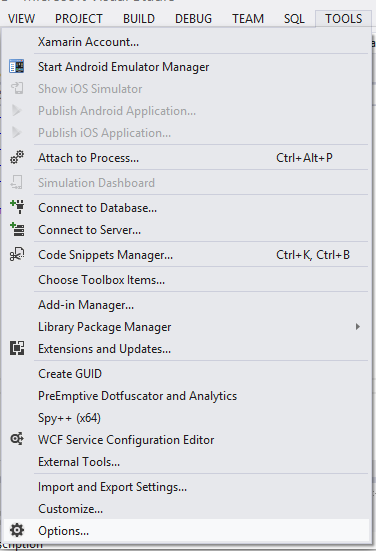
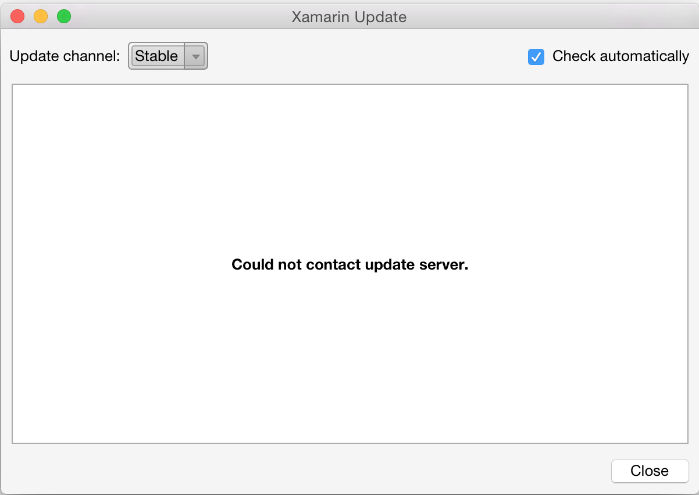

- [Visual Studio for Mac](https://docs.microsoft.com/en-us/visualstudio/mac/update)
- [Visual Studio 2017](#visualstudio2017)
- [Visual Studio 2015 and earlier](#visualstudio)
- [Troubleshooting](#Troubleshooting)

<a name="visualstudiomac" />
## Change the Updates Channel in Visual Studio for Mac

For information on updating in Visual Studio for Mac, refer to the [Visual Studio for Mac – Updating](https://docs.microsoft.com/en-us/visualstudio/mac/update) guide.

> ⚠️ Xamarin Studio has been replaced by [Visual Studio for Mac](https://docs.microsoft.com/visualstudio/mac/).
> Please install [Visual Studio for Mac](https://docs.microsoft.com/visualstudio/mac/)
> to continue to receive updates and access the latest Alpha and Beta channel preview features.

<a name="visualstudio2017" />
## Change the Updates Channel in Visual Studio 2017

Visual Studio 2017 does not support alpha, beta, and stable channels in
the same way as earlier versions. Instead, there are just two options:

- **Release** – equivalent to the _Stable_ channel on macOS
- **Preview**

> ℹ️ To try out pre-release features, you should
> [download the Visual Studio 2017 Preview installer](https://www.visualstudio.com/en-us/news/releasenotes/vs2017-preview-relnotes), which will offer the option to install **Preview**
> versions of Visual Studio side-by-side (SxS) with the stable (Release) version. More information is available in the [Visual Studio 2017 Preview FAQ](https://www.visualstudio.com/vs/preview/).

The Preview version of Visual Studio may include corresponding Preview
versions of Xamarin functionality, including:

- Xamarin.Forms
- Xamarin Visual Studio Extension
- Xamarin Profiler
- Xamarin Workbooks/Inspector
- Xamarin Remote iOS Simulator

The **Preview Installer** screenshot below shows both Preview and Release options (notice the grey version numbers: version 15.0 is release and version 15.1 is a Preview):

> ℹ️ **NOTE:** the current Preview version is **15.3**

During the installation process, an **Installation Nickname** can be
applied to the side-by-side installation (so they can be distinguished
in the Start menu), as shown below:

### Uninstalling Visual Studio 2017 Preview

The **Visual Studio Installer** should also be used to un-install preview versions of Visual Studio 2017. Read the [uninstalling Xamarin guide](/guides/cross-platform/getting_started/installation/uninstalling_xamarin/) for more information.

<a name="visualstudio" />
## Change the Updates Channel in Visual Studio 2015 and earlier

To change the updates channel in Visual Studio, navigate to the Tools menu and select Options:

 

In the left panel of the Options window, scroll down and open the Xamarin options:

 

Select **Xamarin > Other** to open the panel:

 

From the panel, choose the channel you want to subscribe to, and click *Check Now* to check for updates:

 

# Troubleshooting

You many receive the error **Could not contact update server.**, illustrated below, for a number of reasons:

Here are some common solutions to fix this problem:

- Make sure that you have an active connection to the internet.
- There may be endpoints that you need to whitelist on your firewall. Follow the steps in the [Firewall Configuration Instructions](https://developer.xamarin.com/guides/cross-platform/getting_started/installation/firewall/#Software_Updates) to make sure that all the correct endpoints have been whitelisted.
- Make sure that you are logged in to your IDE with your Xamarin Account. You may want to try to log out and log back in again.
- Restart your IDE
