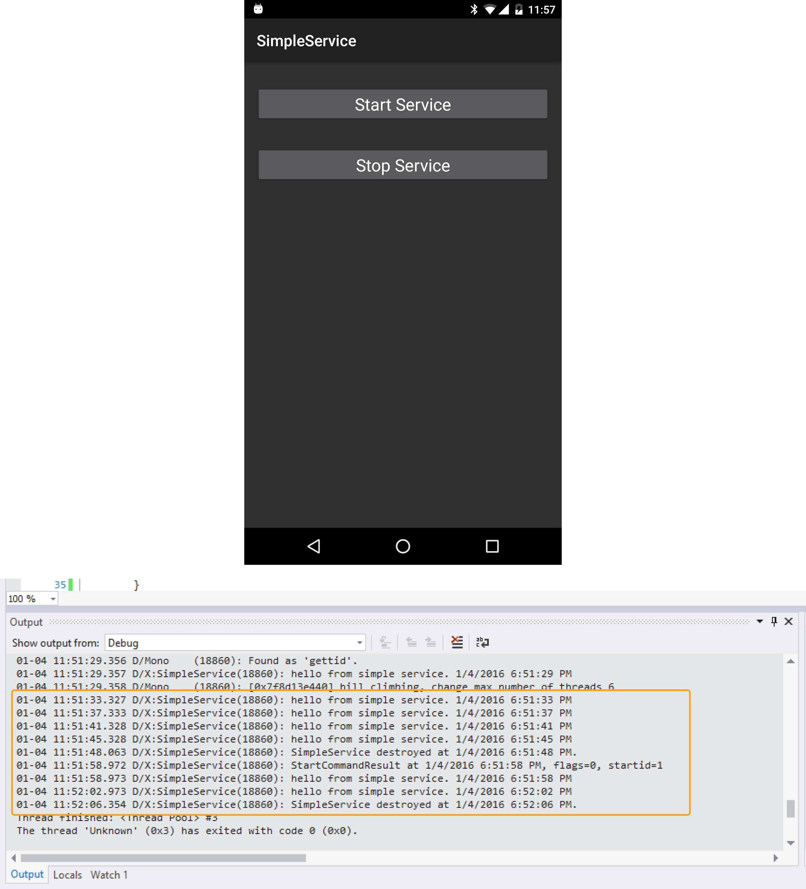

id:{DCEC2052-373D-C101-30F0-6BFA78C498AB}  
title:Create a Simple Service  
brief:This recipe shows how to create a service.  
samplecode:[Browse on GitHub](https://github.com/xamarin/recipes/tree/master/android/fundamentals/service/create_a_simple_service)  
sdk:[Service Class Reference](http://developer.android.com/reference/android/app/Service.html)  
dateupdated: 2016-01-04


# Recipe

This recipe will demonstrate how to start and stop an Android service using an Intent.



1.  Create a new Xamarin.Android application named **SimpleService**.
2.  Add a new class named **SimpleService**, setting its base class to `Android.App.Service`.
3.  Add the following code to SimpleService to create a timer in `OnStartCommand` when the service starts and dispose it in `OnDestroy` when the service stops. For demonstration, we’ll just write some text to the debug log.

```
static readonly string TAG = "X:" + typeof (SimpleService).Name;
static readonly int TimerWait = 4000;
Timer _timer;

public override StartCommandResult OnStartCommand(Intent intent, StartCommandFlags flags, int startId)
{
    Log.Debug(TAG, "OnStartCommand called at {2}, flags={0}, startid={1}", flags, startId, DateTime.UtcNow);
    _timer = new Timer(o => { Log.Debug(TAG, "Hello from SimpleService. {0}", DateTime.UtcNow); },
                       null,
                       0,
                       TimerWait);
    return StartCommandResult.NotSticky;
}

public override void OnDestroy()
{
    base.OnDestroy();

    _timer.Dispose();
    _timer = null;

    Log.Debug(TAG, "SimpleService destroyed at {0}.", DateTime.UtcNow);
}

public override IBinder OnBind(Intent intent)
{
    // This example isn't of a bound service, so we just return NULL.
    return null;
}
```

<ol start="4">
  <li>Add a <code>ServiceAttribute</code> to the <code>SimpleService</code> class.</li>
</ol>

```
[Service]
public class SimpleService : Service
```

 <a name="Additional_Information" class="injected"></a>


# Additional Information

Android services run in the background, separate from the application. They
are well suited to long running tasks such as completing a web upload, playing
background audio and receiving location updates.
