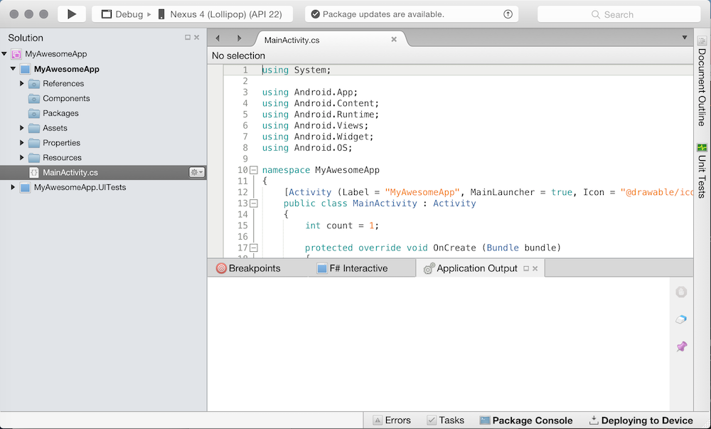

id:{7AAA95E0-6B6C-27AE-A682-7CB7451D70AB}  
title:Create an Android Project  
brief:This recipe shows how to create a new Android project in Xamarin and Visual Studio.  
article:[Hello, Android](/guides/android/getting_started/hello,_world)  

# Recipe

<ide name="xs">
  <ol>
    <li>First, launch Xamarin Studio and click on New... in the top
    left corner: 
    <li>A window will pop up with a list of options for the types of projects
    available to you. To create an Android project, select the Android>App category to open up
    the available sub-categories, then choose Android App: </li>
    <li>Choose a sensible name for your app and choose development targets: </li>
    <li>Choose a project name, then click OK:  </li>
    <li>Xamarin Studio will create and populate a new project for you: </li>
  </ol>
</ide>
<ide name="vs">
  <ol>
    <li>First, launch Visual Studio and click on New Project... in the top
    left corner: 
    <li>A window will pop up with a list of options for the types of projects
    available to you. To create an Android project, select the Android then Blank App (Android). Enter a project name: </li>
    <li>Visual Studio will create and populate a new project for you: </li>
  </ol>
</ide>

## Additional Information

If you are using periods in your project name, do not use *Android* in your project name, as this will result in namespace conflicts and build failures. For example, do not name your project "Hello.Android" - use "Hello.Droid" instead.
