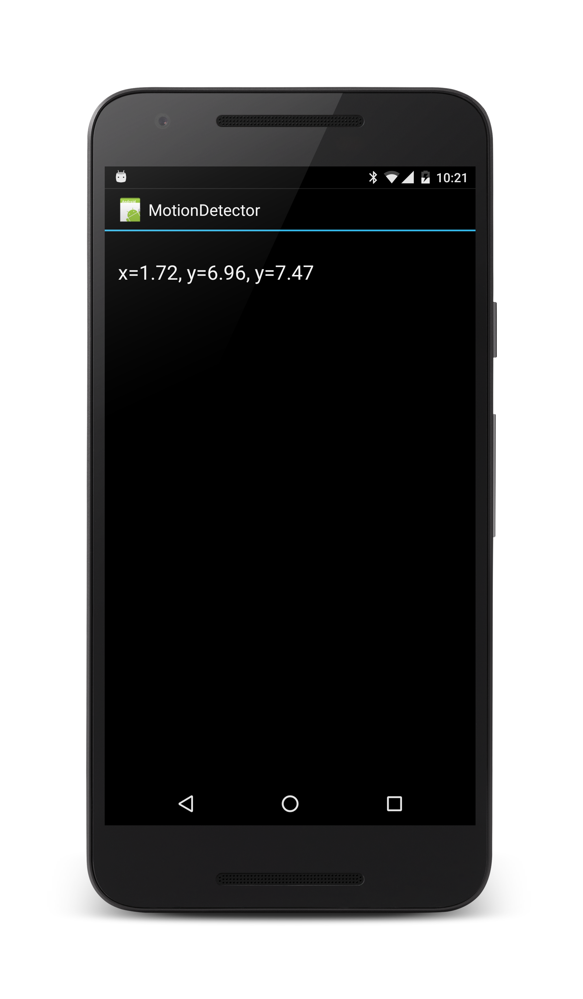
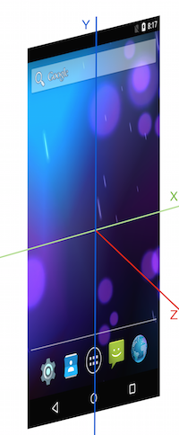

This recipe will show how to use the accelerometer to measure a device’s motion
in three dimensions.

 [ ](Images/MotionDetector.png)

# Recipe

1.  Create a new Xamarin.Android application named `MotionDetector`.
2.  Edit **Main.axml** so that it contains a single `TextView`: 

```
<?xml version="1.0" encoding="utf-8"?>
<LinearLayout xmlns: android="http: //schemas.android.com/apk/res/android"
    android: orientation="vertical"
    android: layout_width="fill_parent"
    android: layout_height="fill_parent">
    <TextView
        android: id="@+id/accelerometer_text"
        android: layout_width="fill_parent"
        android: textAppearance="?android: attr/textAppearanceLarge"
        android: layout_height="wrap_content"
        android: text="TEXT"
        android: layout_marginLeft="15dp"
        android: layout_marginRight="15dp"
        android: layout_marginTop="30dp" />
</LinearLayout>
```

<ol start="3">
  <li>Add some instance variables to <code>Activity1.cs</code>: </li>
</ol>

```
static readonly object _syncLock = new object();
SensorManager _sensorManager;
TextView _sensorTextView;
```

<ol start="4">
  <li>Have <code>Activity1</code> implement the interface <code>ISensorEventListener</code> and implement the methods for the interface: </li>
</ol>

```
public void OnAccuracyChanged(Sensor sensor, SensorStatus accuracy)
{
    // We don't want to do anything here.
}

public void OnSensorChanged(SensorEvent e)
{
    lock (_syncLock)
    {
        _sensorTextView.Text = string.Format("x={0: f}, y={1: f}, y={2: f}", e.Values[0], e.Values[1], e.Values[2]);
    }
}

```

<ol start="5"><li>Change <code>OnCreate</code>: </li></ol>

```
protected override void OnCreate(Bundle bundle)
{
    base.OnCreate(bundle);
    SetContentView(Resource.Layout.Main);
    _sensorManager = (SensorManager) GetSystemService(Context.SensorService);
    _sensorTextView = FindViewById<TextView>(Resource.Id.accelerometer_text);
}
```

<ol start="6">
  <li>Override <code>OnResume</code> so that the application will listen to updates from the accelerometer. The application will begin listening to updates from the accelerometer: </li>
</ol>

```
protected override void OnResume()
{
    base.OnResume();
    _sensorManager.RegisterListener(this,
                                    _sensorManager.GetDefaultSensor(SensorType.Accelerometer),
                                    SensorDelay.Ui);
}

```

<ol start="7">
  <li>Override <code>OnPause</code> so that the application will stop listening to the accelerometer when the application is not active. This is done to reduce the drain on the battery and to preserve battery life: </li>
</ol>

```
protected override void OnPause()
{
    base.OnPause();
    _sensorManager.UnregisterListener(this);
}
```

<ol start="8">
  <li>Run the application on a device. As the device is moved around, the accelerometer values will display on the screen.</li>
</ol>


## Additional Information

The accelerometer returns values that describe the changes in acceleration
along the three axes of the coordinate system measured in m/s2. These axes are
show in the diagram below: 

 