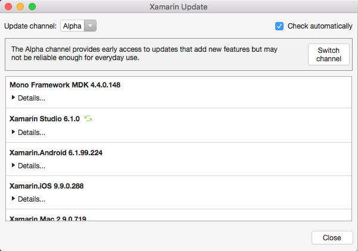

## Change the Updates Channel in Xamarin Studio on Mac

In Xamarin Studio on Mac, select **Check for Updates** from the main menu in the top left: 

 

Select the channel you wish to receive updates from: 

 

## Change the Updates Channel in Visual Studio

To change the updates channel in Visual Studio, navigate to the Tools menu and select Options: 

 

In the left panel of the Options window, scroll down and open the Xamarin options: 

 

Select either **Other** to open the panel: 

 

From the panel, choose the channel you want to subscribe to, and click *Check Now* to check for updates: 

 

#Troubleshooting

You many receive the error **Could not contact update server.**, illustrated below, for a number of reasons: 

The points listed below are common solutions to fix this problem: 

*  Make sure that you have an active connection to the internet.
* There may be endpoints that you need to whitelist on your firewall. Follow the steps in the [Firewall Configuration Instructions](https: //developer.xamarin.com/guides/cross-platform/getting_started/installation/firewall/#Software_Updates) to make sure that all the correct endpoints have been whitelisted.
* Make sure that you are logged in to your IDE with your Xamarin Account. You may want to try to log out and log back in again.
* Restart your IDE