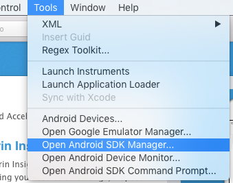
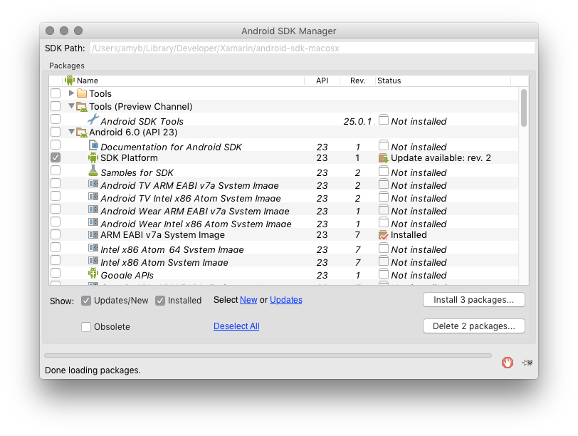
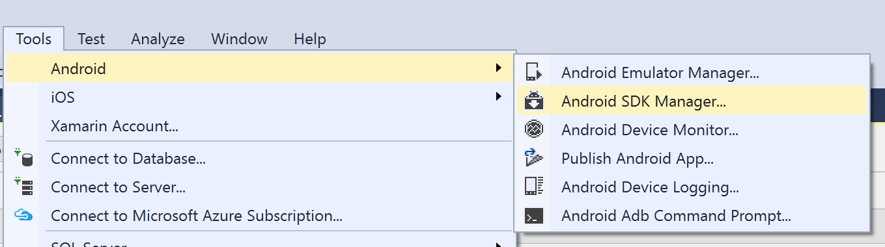
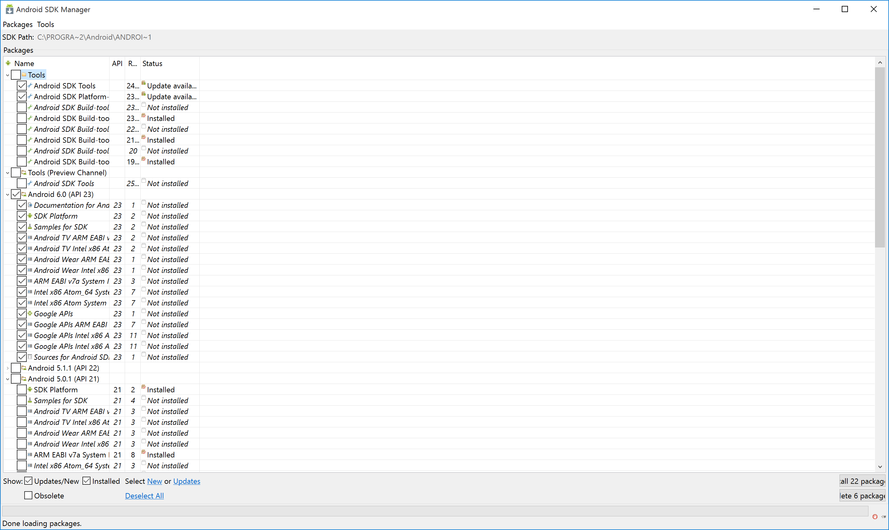

id:{c0b4b42f-6c76-4c38-b0d2-e1042c583850}  
title:Launch the SDK Manager from Xamarin Studio  
brief:This recipe shows how to launch the Android SDK Manager from Xamarin Studio on Mac and Windows.  

# Recipe

 

## Launch SDK Manager from Xamarin Studio

To launch the Android SDK Manager on a Mac, navigate to the *Tools* menu and select <strong>Open Android SDK Manager</strong>:

 

The SDK Manager window will open:

 
 
 You can use this manager to select tools, documentation, and the SDK that you wish to download or update.

 

## Launch SDK Manager from Visual Studio

To launch the Android SDK on Windows, navigate to the *Tools > Android* menu and select <strong>Open Android SDK Manager</strong>:

 

The SDK Manager window will open:

 
 
 You can use this manager to select tools, documentation, and the SDK that you wish to download or update.