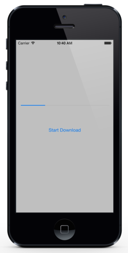

# Report Download Progress

In order to retain a responsive UI, mobile applications should perform network tasks - such as downloading a file -  in the background. This recipe will show how to asynchronously download a file while reporting progress to an Android or iOS application.

There are two main parts to this recipe:

1.  **Downloading the File** - Downloading the file should be performed asynchronously and not block the UI thread. The code for download the file can be shared between Android and iOS.
1.  **Display Progress** - Display download progress to the user is platform specific. This recipe has two separate projects (one for Xamarin.Android and another for Xamarin.iOS) that demonstrate how to display download progress to the user.


The following screen shots show this recipe running on an Android and iOS device, respectively:

  


# Downloading the File

The code for downloading a file exists in the project `AsyncProgressReporting.Common`. The first and most important class is `AsyncProgressReporting.Common.DownloadHelper`. This class contains a single method, `CreateDownloadTask`. This method has the sole responsibility of creating a `Task<T>` instance that will perform the download on a background thread. The following code snippet shows how to encapsulate the logic for downloading the file in a `Task` object:

```
public static async Task<int> CreateDownloadTask(string urlToDownload, IProgress<DownloadBytesProgress> progessReporter)
{
	int receivedBytes = 0;
	int totalBytes = 0;
	WebClient client = new WebClient();

	using (var stream = await client.OpenReadTaskAsync(urlToDownload))
	{
		byte[] buffer = new byte[4096];
		totalBytes = Int32.Parse(client.ResponseHeaders[HttpResponseHeader.ContentLength]);

		for (;;)
		{
			int bytesRead = await stream.ReadAsync(buffer, 0, buffer.Length);
			if (bytesRead == 0)
			{
				await Task.Yield();
				break;
			}

			receivedBytes += bytesRead;
			if (progessReporter != null)
			{
				DownloadBytesProgress args = new DownloadBytesProgress(urlToDownload, receivedBytes, totalBytes);
				progessReporter.Report(args);
			}
		}
	}
	return receivedBytes;
}
```

The first thing this method does is to get the size of the file to download. Then the `async`/ `await` API is used to download in a background thread, 4096 bytes at a time. After each block of 4096 bytes, the UI will be updated to show the progress of the download. When the download is done, we will return the number of bytes that were received.

The download progress will be reported to the UI by an instance of `System.IProgress<T>`. This interface contains a single method, `Report(T value)` that called as appropriate to provide progress information to interested clients. It is the responsibility of the client app to do something with this information, such as update a progress bar with the number of bytes received. In this example, all of the information about the download and is progress is contained in an instance of the class `DownloadBytesProgress`. This class is shown in the following code snippet:

```
public class DownloadBytesProgress
{
	public DownloadBytesProgress(string fileName, int bytesReceived, int totalBytes)
	{
		Filename = fileName;
		BytesReceived = bytesReceived;
		TotalBytes = totalBytes;
	}

	public int TotalBytes { get; private set; }

	public int BytesReceived { get; private set; }

	public float PercentComplete { get { return (float)BytesReceived / TotalBytes; } }

	public string Filename { get; private set; }

	public bool IsFinished { get { return BytesReceived == TotalBytes; } }
}
```

The next section will discuss how a mobile application will consume these two classes.


# Reporting Progress

Visually, reporting progress is very specific to the the platform that the application is running on. Android provides a `ProgressBar` widget, while iOS uses the `UIProgressView` to display a progress bar to the user. In either case, the progress bar control will be updated by an instance of the [Progress&lt;T&gt;](http://msdn.microsoft.com/en-us/library/hh193692(v=vs.110).aspx) class from version 4.5 of the .NET framework. This class encapsulates a handler that is responsible for updating the widget/view is very similar.


## Reporting Progress in Android

The download is started by the user clicking on the *Download File* button. The Xamarin.Android application utilizes a [ProgressBar](http://developer.android.com/reference/android/widget/ProgressBar.html) widget to display the download progress.

The button that begins the download has the following asynchronous event handler assigned to it's `Click` event:

```
async void StartDownloadHandler(object sender, System.EventArgs e)
{
    _progressBar.Progress = 0;
    Progress<DownloadBytesProgress> progressReporter = new Progress<DownloadBytesProgress>();
    progressReporter.ProgressChanged += (s, args) => _progressBar.Progress = (int)(100 * args.PercentComplete);

    Task<int> downloadTask = DownloadHelper.CreateDownloadTask(DownloadHelper.ImageToDownload, progressReporter);
    int bytesDownloaded = await downloadTask;
    System.Diagnostics.Debug.WriteLine("Downloaded {0} bytes.", bytesDownloaded);
}
```

In the previous code snippet, the `Progress<T>` encapsulates a lambda that will update `ProgressBar`, displaying the percentage of bytes that were downloaded. It is important to realize that `Progress<T>` will execute in the same `SynchronizationContext` it which it was instantiated. So, because `Progress<T>` is created on the UI thread, it will run in the UI thread. It is not necessary to explicitly use `RunOnUIThread` inside the provided lambda to update the UI.

The next section will examine the iOS project.


## Reporting Progress in iOS

Similar to the Android project, the iOS project uses an instance of the `Progress<T>` class that. The following event handler is attached to the `TouchUpInside` event of a `UIButton`:

```
async void StartDownloadHandler(object sender, EventArgs e)
{
	ProgressBar.Progress = 0f;

	Progress<DownloadBytesProgress> progressReporter = new Progress<DownloadBytesProgress>();
	progressReporter.ProgressChanged += (s, args) => ProgressBar.Progress = args.PercentComplete;

	Task<int> downloadTask = DownloadHelper.CreateDownloadTask(DownloadHelper.ImageToDownload, progressReporter);
	int bytesDownloaded = await downloadTask;
	Debug.WriteLine("Downloaded {0} bytes.", bytesDownloaded);
}
```

This code snippet is very similar to the Xamarin.Android example that was used in the previous section - the most noticeable difference is that `UIProgressView` displays a `float` value for progress while Android's `ProgressBar` displays an `int` value.


# Summary

This recipe demonstrate how to report download progress in a Xamarin.Android and a Xamarin.iOS application asynchronously. It demonstrated on how to encapsulate the download in a `Task<T>` instance. It then showed how to update the user interface by using an instance of `Progress<T>` to update the user interface with the progress.
