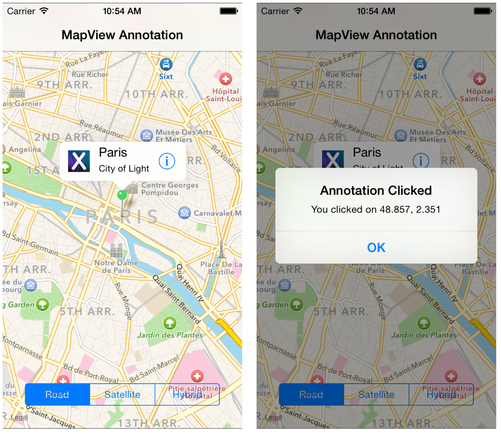

---
id:{EDB7429B-839E-7E9F-19A2-133E442C145C}  
title:Handle Annotation Click  
brief:This recipe shows how to add an annotation with a clickable button to a map.  
samplecode:[Browse on GitHub](https://github.com/xamarin/recipes/tree/master/ios/content_controls/map_view/handle_annotation_click)  
article:[Add an Annotation](/recipes/ios/content_controls/map_view/add_an_annotation_to_a_map)  
article:[Displaying a Location](/recipes/ios/content_controls/map_view/display_device_location)  
sdk:[MKMapView Class Reference](https://developer.apple.com/library/ios/#documentation/MapKit/Reference/MKMapView_Class/MKMapView/MKMapView.html)  
sdk:[MKAnnotation Protocol Reference](https://developer.apple.com/library/ios/documentation/MapKit/Reference/MKAnnotation_Protocol/)  
---

<a name="Recipe" class="injected"></a>


# Recipe

To add an annotation and respond to touching a button within the
annotation:

1.  Start with an existing `MKMapView` or review the  [Displaying a Location](/recipes/ios/content_controls/map_view/display_device_location) and  [Add an Annotation](/recipes/ios/content_controls/map_view/add_an_annotation_to_a_map) recipes.
2.  Add an annotation as you normally would:


```
var annotation = new BasicMapAnnotation (new CLLocationCoordinate2D (48.857, 2.351), "Paris", "City of Light");
mapView.AddAnnotation (annotation);
```

<ol start="3">
	<li>Create a `MKMapViewDelegate` subclass (as shown). Notice how the `GetViewForAnnotation` method adds features such as the `LeftCalloutAccessoryView` and `RightCalloutAccessoryView`. </li>
</ol>


```
protected class MapDelegate : MKMapViewDelegate
{
	protected string annotationIdentifier = "BasicAnnotation";
	UIButton detailButton;
	MapViewController parent;

	public MapDelegate(MapViewController parent)
	{
		this.parent = parent;
	}

	/// <summary>
	/// This is very much like the GetCell method on the table delegate
	/// </summary>
	public override MKAnnotationView GetViewForAnnotation (MKMapView mapView, IMKAnnotation annotation)
	{

		// try and dequeue the annotation view
		MKAnnotationView annotationView = mapView.DequeueReusableAnnotation(annotationIdentifier);
		
		// if we couldn't dequeue one, create a new one
		if (annotationView == null)
			annotationView = new MKPinAnnotationView(annotation, annotationIdentifier);
		else // if we did dequeue one for reuse, assign the annotation to it
			annotationView.Annotation = annotation;
     
		// configure our annotation view properties
		annotationView.CanShowCallout = true;
		(annotationView as MKPinAnnotationView).AnimatesDrop = true;
		(annotationView as MKPinAnnotationView).PinColor = MKPinAnnotationColor.Green;
		annotationView.Selected = true;
		
		// you can add an accessory view, in this case, we'll add a button on the right, and an image on the left
		detailButton = UIButton.FromType(UIButtonType.DetailDisclosure);

		detailButton.TouchUpInside += (s, e) => { 
			Console.WriteLine ("Clicked");
			//Create Alert
			var detailAlert = UIAlertController.Create ("Annotation Clicked", "You clicked on " + 
				(annotation as MKAnnotation).Coordinate.Latitude.ToString() + ", " +
				(annotation as MKAnnotation).Coordinate.Longitude.ToString(), UIAlertControllerStyle.Alert);
			detailAlert.AddAction (UIAlertAction.Create ("OK", UIAlertActionStyle.Default, null));
			parent.PresentViewController (detailAlert, true, null); 
		};
		annotationView.RightCalloutAccessoryView = detailButton;
		
		annotationView.LeftCalloutAccessoryView = new UIImageView(UIImage.FromBundle("29_icon.png"));
		
		return annotationView;
	}
	
	// as an optimization, you should override this method to add or remove annotations as the 
	// map zooms in or out.
	public override void RegionChanged (MKMapView mapView, bool animated) {}
}
```

<ol start="4">
	<li>Finally, assign the delegate (prior to the code added earlier to add the annotation to the MKMapView instance): </li>
</ol>


```
// assign the delegate, which handles annotation layout and clicking
  // the Delegate needs to be assigned before adding the annotation
  mapView.Delegate = new MapDelegate(this);

  var annotation = new BasicMapAnnotation (new CLLocationCoordinate2D (48.857, 2.351), "Paris", "City of Light");
  mapView.AddAnnotation (annotation);
```

 [ ](Images/MapOverlayClick.png)