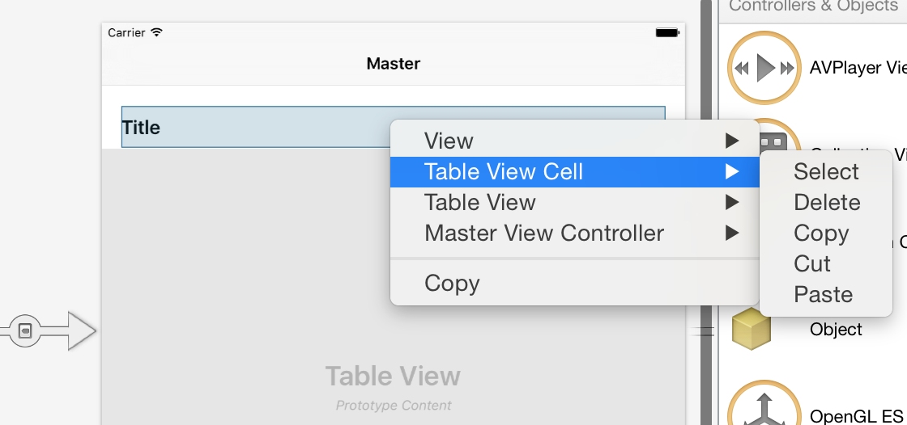

### Referencing the Custom Cell

1. Create a new Master Detail Solution and name it **CustomCellDemo**.

<ide name="xs">
<ol start="2">
	<li>Open the `Main.Storyboard` file and  right-click on the table cell in the <strong>Master View Controller</strong> to delete it: 
	 </li>
	<li>Add a new file by right-clicking on the solution name and selecting <em>Add > New File...</em>. Select the <strong>TableViewCell</strong> template, and name it <strong>Cell</strong>: 
	  
	This will create a .xib file plus a backing class
	</li>
	<li>Double click on the Cell.xib file to open it in the iOS Designer</li>
	<li>In the properties panel, change the background color.</li>
	<li>To register the .xib for cell reuse, add the following line of code to the <code>MasterViewController</code> class before you set <code>TableView.Source</code> in the <code>ViewDidLoad()</code> method: 
	<pre><code>
		public override void ViewDidLoad ()
		{
			base.ViewDidLoad ();

			...

			TableView.RegisterNibForCellReuse(Cell.Nib, "Cell");
			TableView.Source = dataSource = new DataSource (this);
		}
	</code></pre>
	</li>
	<li>Run the application and test it, you should notice that the background color of the cell, matches the background color of the cell in your .xib.</li>
</ol>	
</ide>

<ide name="vs">
	<ol start="2">
		<li>Open the `Main.Storyboard` file and  right-click on the table cell in the <strong>Master View Controller</strong> to delete it: 
		 </li>
		<li> Add a new item by right-clicking on the solution name and selecting <em>Add > New Item...</em>. Select the View template and name it <strong>Cell</strong>: 
		  
		This will create a .xib file with <strong>no</strong> backing class
		</li>
		<li>If the .xib file doesn't open automatically, double-click on the <strong>Cell.xib</strong> file to open it in the Designer.</li>
		<li>Delete the View on the design surface and add a <strong>Table View Cell</strong> from the toolbox: 
		 </li>
		<li>We now need to give it a code behind class so that we can access the .xib in code. To do this select the Table View Cell, and in the properties explorer under <em>Identity > Class</em> enter <code>Cell</code>: 
		 </li>
		<li>In the properties panel, change the background color: 
		 </li>
		<li>To register the .xib for cell reuse, add the following line of code to the <code>MasterViewController</code> class before you set <code>TableView.Source</code> in the <code>ViewDidLoad()</code> method: 
		<pre><code>
		public override void ViewDidLoad ()
		{
			base.ViewDidLoad ();

			...

			TableView.RegisterNibForCellReuse(UINib.FromName("Cell", null), "Cell”);
			TableView.Source = dataSource = new DataSource (this);
		}
		</code></pre>
		</li>
		<li>Run the application and test it, you should notice that the background color of the cell, matches the background color of the cell in your .xib.</li>
	</ol>
</ide>
