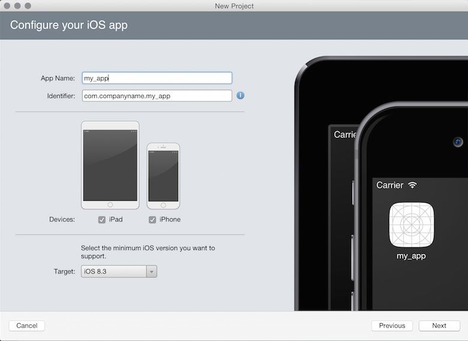
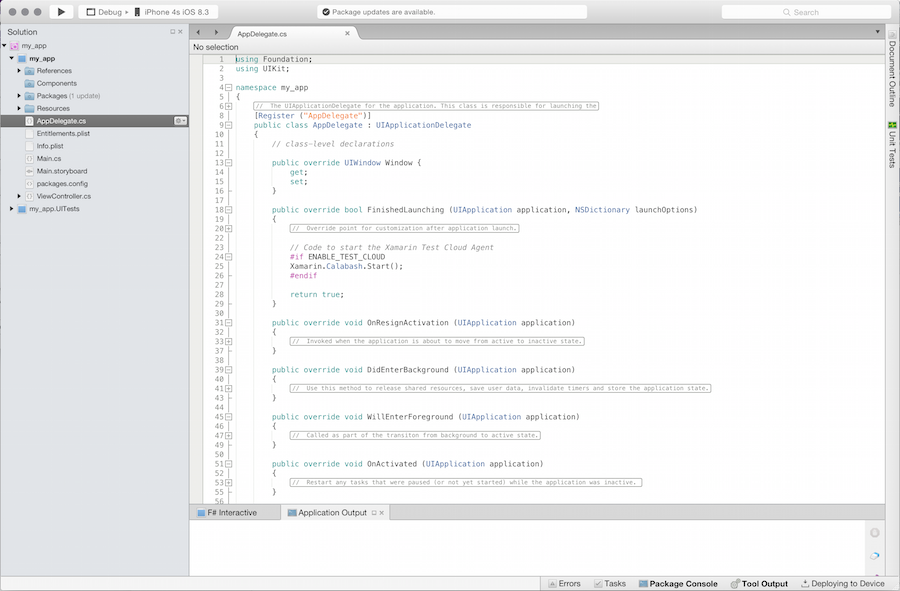

id:{60CB8D6D-3E26-BD8D-88F0-3B63FE1BC8F7}  
title:Create an iOS Project  
brief:This recipe shows how to create a new iOS project.  
article:[Hello, iPhone](/guides/ios/getting_started/hello,_world)  

# Recipe
<ide name="xs">
<h2>Create an iOS Project in Xamarin Studio</h2>
<ol>
  <li>First, launch Xamarin Studio and click + New Solution... in the upper left corner: </li>
  <li>A window will pop up asking you to choose a template for the project. Select App under iOS in the panel on the left. Then select the desired app type from the list of options and click Next. If you are new to Xamarin.iOS and don't know which to choose, select Single View Application. </li>
  <li>The window will move to the Configure your iOS app screen. Enter the name of your app, select the devices you'd like to support and choose a minimum target OS. </li>
  <li>The window will move to the Configure your new project screen. Choose the name of the project (avoiding spaces and special characters) and the location on disk to store the project, then click Create</li>
  <li>Xamarin Studio will create your new iOS app. </li>
</ol>
</ide>
<ide name="vs">
<h2>Create an iOS Project in Visual Studio</h2>
<ol>
  <li><a href="/guides/ios/getting_started/introduction_to_xamarin_ios_for_visual_studio">Make sure Xamarin.iOS for Visual Studio is configured correctly</a>. Launch Visual Studio and choose File > New > Project: <im src="Images/ios_project_00_vs.png" /></li>
  <li>A window will pop up with a list of options for the types of projects available to you. To create an iOS project, choose the Templates and then the Visual C# category to open up the available sub-categories, then select iOS:</li>
  <li>Choose your device from the menu on the left. If you are new to Xamarin.iOS and unsure about what template to use, select Single View Application from the panel on the right. This will create an application with one view and one View Controller.</li>

  <li>Choose a sensible name for your project, avoiding spaces and special characters, and click OK.
  <li>Visual Studio will create and populate a new project for you:
</ol>
 </ide>
